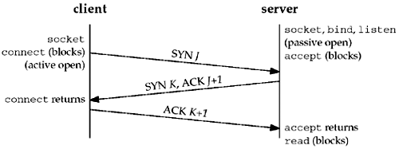
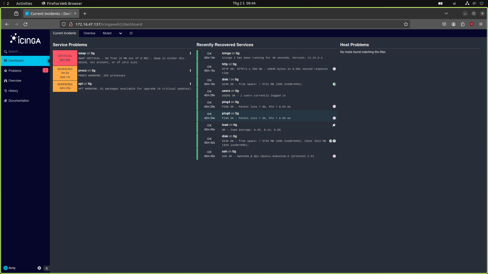
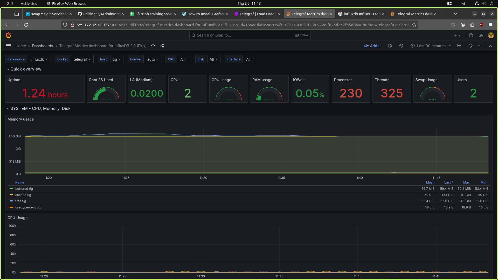

# Network

  
Table of Contents

    <ol>
	    <li>Tam</li>
    </ol>

## Mô hình OSI, TCP/IP

### Mô hình OSI

Có 7 lớp trong mô hình OSI:

+ Lớp ứng dụng (application layer):

	+ Là lớp duy nhất tương tác trực tiếp với dữ liệu từ người dùng. Các ứng dụng như trình duyệt web, email đều dựa vào lớp ứng dụng để bắt đầu kết nối.

	+ Cung cấp giao thức và thao tác dữ liệu mà các phần mềm dựa vào để trình bày dữ liệu tới người dùng.

	+ Các giao thức của lớp ứng dụng gồm HTTP, SMTP.

+ Lớp trình bày (presentation layer):

	+ Chức năng chính là giải quyết vấn đề liên quan đến cú pháp, ngữ nghĩa của dữ liệu hiển thị tại lớp ứng dụng.

	+ 2 thiết bị kết nối có thể sử dụng 2 phương pháp `encoding` (mã hóa) khác nhau nên lớp trình bày cần chuyển dữ liệu thành cú pháp mà lớp ứng dụng có thể hiểu.

	+ Nếu các thiết bị kết nối sử dụng kết nối mã hóa thì lớp trình bày phải thêm mã hóa ở phía người gửi và thêm giải mã ở phía người nhận để lớp ứng dụng có dữ liệu đọc được, không bị mã hóa.

	+ Nén dữ liệu nhận được từ lớp ứng dụng trước khi chuyển xuống lớp phiên.

+ Lớp phiên (session layer):

	+ Cho phép mở và đóng liên kết giữa 2 thiết bị. Đảm bảo phiên mở đủ lâu để truyền hết dữ liệu và đóng phiên để giảm tài nguyên.

	+ Truyền dữ liệu với các `checkpoints`. Ví dụ cần truyền 100MB thì có thể có `checkpoint` mỗi 5MB, nếu liên kết bất ngờ đóng khi đã truyền 52MB thì phiên sẽ tiếp tục ở `checkpoint` cuối (50MB).

+ Lớp truyền tải (transport layer):

	+ Đảm nhiệm cho kết nối end-to-end giữa các thiết bị.

	+ Lấy dữ liệu từ lớp phiên và phân nhỏ thành các `segments` và gửi xuống lớp mạng. Tại thiết bị nhận thì gộp các `segments` thành dữ liệu và gửi lên lớp phiên.

	+ Kiểm soát luồng và lỗi, là tầng cuối cùng chịu trách nhiệm về mức độ an toàn trong truyền dữ liệu.

	+ Có thể thực hiện ghép kênh (multiplex) một vài liên kết thành 1 để giảm giá thành.

+ Lớp mạng (network layer):

	+ Phân phối dữ liệu giữa các thiệt bị khác mạng, nếu trên cùng 1 mạng thì lớp mạng không cần thiết.

	+ Chia nhỏ các `segments` từ lớp truyền tải thành các gói tin. Tại thiết bị nhận thì gộp lại các gói tin nhận được.

	+ Tìm đường đi vật lý tối ưu nhất cho dữ liệu (routing).

	+ Giao thức lớp mạng bao gồm IP, ICMP, IGMP và IPsec.

+ Lớp liên kết dữ liệu (data link layer):

	+ Phân phối dữ liệu từ nút này sang nút khác, các thiết bị trên cùng một mạng.

	+ Nhận gói tin từ `network` và chia nhỏ thành các `frames`, truyền tuần tự các `frame`, xử lý thông điệp xác nhận (ACK).

	  --> Kiểm soát lỗi, luồng, lưu lượng.

	+ Chuyển đổi các `frame` thành chuỗi bit và chuyển xuống lớp vật lý.
    
+ Lớp vật lý (physical layer):

	+ Bao gồm các thiết bị vật lý liên quan đến việc truyền dữ liệu (cáp, thiết bị chuyển mạch, ...).

	+ Có chức năng truyền chuỗi bit qua các phương tiện vật lý.

Ưu điểm: 

+ Hỗ trợ cả 2 service: connection-oriented (hướng liên kết) và connectionless (không liên kết).
+ Tất cả các lớp đều hoạt động độc lập.
+ Bảo mật và đáng tin cậy hơn mô hình TCP/IP
+ Tách biệt giao diện, giao thức và dịch vụ -> khá linh hoạt.

Nhược điểm:

+ Cài đặt mô hình khó.
+ Không hỗ trợ các giao thức và ứng dụng thường dùng ở internet như HTTP, FTP, TCP, UDP, IP, and Ethernet --> sử dụng như 1 mô hình tham khảo.

### Mô hình TCP/IP

Có 4 lớp trong mô hình TCP/IP:

+ Lớp vật lý (Physical):
	+ Có tên khác là lớp giao diện mạng (Network Interface Layer).
	+ Là sự kết hợp của lớp vật lý và lớp liên kết dữ liệu của mô hình OSI.
	+ Đảm nhiệm tạo dữ liệu và yêu cầu kết nối.
	+ Dữ liệu được đóng gói vào khung (`frame`)  và được định tuyến.
+ Lớp mạng (Internet):
	+ Gần giống với lớp mạng của mô hình OSI.
 	+ Định nghĩa giao thức chịu trách nhiệm truyền dữ liệu trong mạng.
  	+ Các phân đoạn dữ liệu được đóng gói thành các `packets` với kích thước phù hợp với mạch chuyển mạng mà nó được dùng để vận chuyển.
  	+ Thêm header chứa thông tin của lớp mạng vào `packet` và vận chuyển đến lớp tiếp theo.
  	+ Giao thức của lớp mạng bao gồm IP, ICMP, ARP.
+ Lớp truyền tải (Transport):
	+ Xử lý các vấn đề giao tiếp: trao đổi tín hiệu ACK (xác nhận đã nhận dữ liệu), truyền lại các `packets` bị thiếu, đảm báo các `packets` được truyền đến đúng thứ tự và không lỗi.
	+ Giao thức của lớp mạng bao gồm TCP, UDP.
+ Lớp ứng dụng (Application):
	+ Đảm nhiệm vai trò giao tiếp giữa 2 thiết bị thông qua các dịch vụ mạng (trình duyệt web, email, ...).
 	+ Dữ liệu định dạng theo kiểu Byte to Byte, cùng với các thông tin định tuyến giúp xác định đường đi đúng của gói tin.
  	+ Giao thức của lớp ứng dụng bao gồm HTTP, FTP, POP3, SMTP, SNMP.  

Ưu điểm:

+ Hỗ trợ nhiều giao thức định tuyến.
+ Dễ áp dụng và mở rộng.
+ Sử dụng kiến trúc client-server --> dễ quản lý, bảo mật tốt hơn và chia sẻ tài nguyên.
+ Là mô hình được áp dụng trong thực tế.

Nhược điểm:

+ Khả năng bảo mật và đáng tin cậy kém hơn mô hình OSI

--> Cả 2 mô hình đều mô tả cách mà dữ liệu được truyền giữa 2 thiết bị qua mạng, dữ liệu được xử lý thông qua các lớp trong mô hình, mỗi lớp có một chức năng riêng.

Điẻm khác biệt:

| OSI | TCP/IP |
|-----|--------|
| Có cấu trúc liên quan đến cách hoạt động của mạng | Là giao thức kết nối dựa trên các giao thức mạng chuẩn và cho phép các máy kết nối qua mạng |
| Không phụ thuộc vào giao thức | Phụ thuộc vào giao thức |
| Gồm 7 lớp, mỗi lớp có 1 chức năng riêng | Gồm 4 lớp, trong đó lớp vật lý là sự kết hợp của lớp vật lý và liên kết dữ liệu của mô hình OSI, lớp ứng dụng là sự kết hợp của lớp phiên, trình bày và ứng dụng của mô hình OSI |

## UDP và TCP

### UDP

Là giao thức giao tiếp không đáng tin cậy (không có tính năng xác thực, khôi phục sau lỗi và kiểm soát luồng).

Dữ liệu được chia thành các gói tin. Mỗi gói tin chứa đủ thông tin để xác định nguồn, đích và kiểm soát lỗi.

UDP không yêu cầu thiết lập kết nối trước khi truyền tải các gói tin. Có thể gửi trực tiếp các gói tin đến IP và cổng nhận.

UDP sử dụng trong trường hợp cần muốn ưu tiên thời gian truyền tải, cần thời gian thực, chấp nhận bỏ qua gói tin thay vì chờ đợi. UDP được sử dụng trong truyền tải audio/video trực tuyến (streaming), game trực tuyến, DNS,... các ứng dụng không yêu cầu tin cậy và thiết lập kết nối trước.

### TCP

Là giao thức đảm bảo truyền tin giữa các thiết bị trong mạng.

Dữ liệu cũng được chia nhỏ thành các gói tin như UDP. Mỗi gói tin chứa các thông tin như địa chỉ nguồn, đích, kiểm tra lỗi, số thứ tự, số ACK, độ đai header, các bit điều khiển cờ, ....

TCP yêu cầu thiết lập kết nối trước khi truyền tin, sử dụng `3-way handshake`.

Quá trình `3-way handshake`:

+ client gửi `SYN` tới server, thông báo với server muốn kết nối.
+ server nhận được và gửi lại `SYN-ACK`. Trong đó, `ACK` để xác nhận yêu cầu kết nối của client và `SYN` để biểu thị số thứ tự mà nó có thể bắt đầu.
+ clent gửi `ACK` để xác nhận đã thiết lập kết nối và sẽ bắt đầu quá trình truyền tải dữ liệu.

Sau khi kết thúc quá trình truyền tải dữ liệu, client sẽ kết thúc kết nối đã thiết lập.

Quá trình hủy kết nối:

+ client gửi `FIN` thông báo muốn kết thúc kết nối đã thiết lập.
+ server nhận được và gửi lại `ACK` để xác nhận quá trình hủy kết nối.
+ server gửi `FIN` để kết thúc kết nối.
+ client gửi `ACK` và kết thúc kết nối.

TCP được sử dụng trong trường hợp cần đảm bảo các gói tin được truyền đi đúng và đủ, thời gian truyền không phải thời gian thực. TCP thường được sử dụng trong truyền tải dữ liệu web, gửi/nhận email, truyền tệp tin giữa máy chủ và client, ....

## IPv4 và IPv6

### IPv4

Cấu trúc: Gồm 32 bit, chia làm 4 cụm (`octet`) với 2 cụm đầu là phần mạng (chỉ định số độc nhất được gán cho mạng và cũng xác định loại mạng được gán), 2 cụm sau là phần host (chỉ định cho mỗi máy, xác định máy trong mạng). --> Trong cùng 1 mạng, phần mạng sẽ giống nhau và phần host sẽ khác nhau.

Phân lớp: Gồm 5 lớp A, B, C, D, E.

+ Lớp A:
	+ 8bit đầu phần mạng (bit đầu luôn là 0) và 24bit sau phần host.
	+ Có các địa chỉ mạng từ `1.0.0.0` đến `126.0.0.0` và mỗi mạng có 224 địa chỉ host.
	+ Dải địa chỉ private: `10.x.x.x`.
+ Lớp B:
	+ 16bit đầu phần mạng (2bit đầu luôn là 1.0) và 16bit sau phần host.
	+ Có các địa chỉ mạng từ `128.0.0.0` đến `191.255.0.0` và mỗi mạng có 214 địa chỉ host.
	+ Dải địa chỉ private: `172.16.x.x` đến `172.31.x.x`.
+ Lớp C:
	+ 24bit đầu phần mạng (3bit đầu luôn là 1.0.0) và 8bit sau phần host.
	+ Có các địa chỉ mạng từ `192.0.0.0` đến `223.255.255.0` và mỗi mạng có 26 địa chỉ host.
	+ Dải địa chỉ private: `192.168.x.x`.
+ Lớp D:
	+ Những địa chỉ `multicast` bao gồm `224.0.0.0` đến `239.255.255.255`. `Multicast`: 1 gói tin có thể chuyển đến nhiều người nhận nhưng có chọn lọc thay vì gửi đến tất cả các thiết bị trong phạm vi như `boardcast`.
+ Lớp E:
	+ Có vai trò dự phòng, bao gồm các địa chỉ từ `240.0.0.0` trở đi.
 	+ Thường được sử dụng trong nghiên cứu, không dùng trong internet thông thường.

Chia IPv4

+ Đầu tiên ta cần xác định địa chỉ IP thuộc lớp nào --> tính được số bit cần mượn --> tính được số bit host sau khi mượn.
+ Tìm số đường mạng theo công thức `2^(số bit mượn)` (số đường mạng có thể phân ra từ mạng gốc).
+ Xác định mỗi đường mạng sẽ có bao nhiêu máy đặt trong đó theo công thức `2^(số bit host sau khi mượn) - 2` vì sẽ phải bỏ đi địa chỉ mạng và boardcast.
+ Tìm subnet mask mới. Dựa vào lớp mạng, mượn bao nhiêu bit sẽ phải bật lên bấy nhiêu bit 1 ở subnet mặc định.
+ Tìm bước nhảy theo công thức `256 - (subnet mask mới)`. --> Số dải IP khả dụng trong mạng

Ví dụ: Từ 192.168.1.1/29 tìm phạm vi địa chỉ host nó thuộc về.

+ Mạng thuộc lớp C, 24bit dùng cho mạng --> mượn `29 - 24 = 5bit` --> số bit host `8 - 5 = 3bit`
+ Số đường mạng `2^5 = 32`
+ Số host mỗi đường mạng `2^3 - 2 = 6`
+ Subnet mới:
	+ subnet mặc định `/24`: `255.255.255.0` --> `11111111.11111111.1111111.00000000`
 	+ mượn 5bit --> `11111111.11111111.11111111.11111000` --> `255.255.255.248`
+ Bước nhảy `256 - 248 = 32`
+ Các dải IP khả dụng
	+ `192.168.1.1` đến `192.168.1.6`, `192.168.1.0`: địa chỉ mạng, `192.168.1.7`: boardcast
	+ `192.168.1.9` đến `192.168.1.14`, `192.168.1.8`: địa chỉ mạng, `192.168.1.15`: boardcast
 	+ `192.168.1.17` đến  `192.168.1.22`, `192.168.1.16`: địa chỉ mạng, `192.168.1.23`: boardcast
  	+ `192.168.1.25` đến `192.168.1.30`, `192.168.1.24`: địa chỉ mạng, `192.168.1.31`: boardcast...
  --> mạng `192.168.1.1/29` thuộc dải `192.168.1.1` đến `192.168.1.6`, với địa chỉ mạng là `192.168.1.0`, boardcast là `192.168.1.7`.
### IPv6

Cấu trúc: Gồm 128bit, được chia làm 8 nhóm, mỗi nhóm gồm 4 số hex tách biệt bằng `:` (IPv6-address/ prefix-length).

Ví dụ: `1080:0000:0000:0070:0000:0989:CB45:345F`, `200F::AB00:0:0:0:0/56` ( 56 prefix cho `200F00000000AB`).

Nén IPv6: Cho phép bỏ `0` trước mỗi nhóm, nhóm toàn `0` thay bằng `0`, thay `::` cho các nhóm liên tiếp toàn `0`.

--> Từ `1080:0000:0000:0070:0000:0989:CB45:345F` thành `1080:0:0:70::989: CB45:345F`.

Bao gồm 3 phần:

+ Site prefix: Định danh mạng hay tổ chức. Cho biết địa chỉ hay mạng thuộc tổ chức nào. 
+ Subnet ID: Phân chia mạng thành các phần nhỏ hơn (`subnet`)
+ Interface ID: Định danh thiết bị trong mạng. Giúp xác định thiết bị cụ thể trong mạng.

Phân loại: Chia làm 3 loại:

+ IPv6 Unicast: 1 địa chỉ Unicast được định nghĩa duy nhất trên một cổng của 1 node IPv6. Gói tin gửi đến Unicast được đưa đến cổng định nghĩa bởi địa chỉ đó.
+ IPv6 Multicast: Được định nghĩa 1 nhóm các cổng IPv6. Gói tin gửi đến Multicast được xử lý bởi tất cả các thành viên của nhóm Multicast.
+ IPv6 Anycast: Được đăng ký cho nhiều cổng trên nhiều node. Gói tin gửi đến Anycast được chuyển đến 1 trong số các cổng Anycast, thường là gần nhất.

## Switching

Là kết hợp nhiều `network interfaces` (giao diện mạng) thành một giao diện liên kết duy nhất, hoạt động cuả giao diện này phụ thuộc vào chế độ (dự phòng hoặc cân bằng tải).

+ Sử dụng hệ điều hành CentOs, thêm 1 mạng vào hệ thống.

	+ Kiểm tra `bonding` đã kích hoạt chưa

			lsmod | grep bonding

 	+ Nếu chưa thì kích hoạt

		 	sudo modprobe --first-time bonding
			modinfo bonding

 	+ Cấu hình `bonding` tự động chạy khi hệ thống khởi động tại `/etc/modprobe.d/bonding.conf`

 			alias bond0 bonding

	+ Kiểm tra các giao diện mạng `ip -c a` --> `ens33` và `ens36` đều `UP`, `bond0` có state `DOWN`.

	+ Cấu hình giao diện `bond0` master tại `/etc/sysconfig/network-scripts/ifcfg-bond0`

			DEVICE=bond0
			IPADDR=172.16.47.130
			NETMASK=255.255.255.0
			GATEWAY=172.16.47.1
			ONBOOT=yes
			BOOTPROTO=no
			USERCTL=no
			NM_CONTROLLED=no
			BONDING_OPTS="miimon=1000 mode=1"

		Với `miimon`: thời gian dám sát MII của NIC (milisecond), `mode=1`: mode active-backup của bonding.

	+ Cấu hình `ens33` slave tại `/etc/sysconfig/network-scripts/ifcfg-ens33`

			DEVICE=ens33
			TYPE=Ethernet
			ONBOOT=yes
			BOOTPROTO=none
			NM_CONTROLLED=no
			MASTER=bond0
			SLAVE=yes

	+ Cấu hình `ens36` slave tại `/etc/sysconfig/network-scripts/ifcfg-ens36`

			DEVICE=ens36
			TYPE=Ethernet
			ONBOOT=yes
			BOOTPROTO=none
			NM_CONTROLLED=no
			MASTER=bond0
			SLAVE=yes

	+ Khởi động giao diện `bond0`

			sudo service network restart

	+ Kiểm tra sử dụng `ip -c a` --> `ens33` và `ens36` có thêm giá trị `SLAVE`, không còn địa chỉ IP.

		`bond0` có giá trị `MASTER`, state `UP` và có giá trị IP, netmask,... theo cấu hình đã cài đặt. 

	+ Kiểm tra cơ chế hoạt động của bonding với `cat /sys/class/net/bond0/bonding/mode` --> `active-backup 1`.

	+ Kiểm tra giao diện mạng bonding có hoạt động không với `cat /sys/class/net/bonding_masters` --> `bond0`.

	+ Thử ngắt kết nối giao diện mạng `ens36` --> chỉ `ens36` `DOWN`, cả `ens33` và `bond0` đều `UP` và vẫn hoạt động bình thường.

	+ Ngắt kết nối cả 2 giao diện mạng `ens33` và `ens36` thì `bond0` `DOWN`.

+ Sử dụng hệ điều hành Ubuntu, thêm 1 mạng vào hệ thống.

	+ Cấu hình `bond0` tại `/etc/netplan/*.yaml`:

 			network:
   				version: 2
   				ethernets:
   					ens33:
   						dhcp4: false
   					ens37:
   						dhcp4: false
   				bonds:
   					bond0:
   						interfaces: [ens33, ens37]
   						dhcp4: false
   						addresses: [172.16.47.100/24]
   						nameservers:
   							addresses: [8.8.8.8]
   						parameters:
   							mode: active-backup
   							mii-monitor-interval: 100
 	+ Áp dụng cấu hình sử dụng `sudo netplan apply`. 
  	
## Routing

Một mạng máy tính được tạo ra từ nhiều máy tính kết nối gọi là các nút và các đường dẫn, liên kết các nút đó. Định tuyến là lựa chọn đường dẫn tốt nhất dựa trên 1 số quy tắc định trước.

Bộ định tuyến là thiết bị mạng kết nối các máy tính và mạng với những mạng khác. Có chức năng xác định đường dẫn, chuyển tiếp dữ liệu và cân bằng tải (gửi bản sao của cùng 1 gói dữ liệu bằng nhiều đường dẫn khác nhau).

Phương pháp hoạt động: 
+ các gói dữ liệu được gửi đến bộ định tuyến trước
+ Bộ định tuyến sau đó sẽ tra cứu gói có tiêu đề và xác định điểm đích của nó 
+ Tự tra cứu bảng nội bộ của nó và chuyển tiếp gói (đến bộ định tuyến tiếp theo hoặc thiết bị khác)
Phân loại:
+ Định tuyến tĩnh: sử dụng bảng tĩnh để đặt cấu hình và chọn các tuyến mạng theo cách thủ công.
+ Định tuyến động: các bộ định tuyến tạo và cập nhật bảng định tuyến trong thời gian chạy dựa trên điều kiện mạng thực tế.

Bảng định tuyến: là 1 bộ quy tắc dưới dạng bảng, lưu thông tin các định tuyến. Bao gồm nhiều entry, mỗi entry chứa thông tin các tuyến đường đến các đích khác nhau.

Cấu trúc 1 entry:
+ Địa chỉ IP đích: có thể là 1 host (host-id khác 0) hoặc 1 mạng (host-id bằng 0).
+ Địa chỉ IP của next-hop router hoặc địa chỉ mạng kết nối trực tiếp: địa chỉ có thể chuyển tiếp gói tin đến đích.
+ Network interface: cổng của router được sử dụng để gửi gói tin đến next-hop.
+ Cờ: cho biết nguồn cập nhật của route.
+ Metric: "khoảng cách" từ router đến IP đích, dùng để so sánh khi các route sử dụng cùng 1 giao thức định tuyến.
+ Administrative Distance: số ưu tiên đặt cho bảng định tuyến, gán cho các giao thức (giá trị từ 0 đến 255, càng bé càng ưu tiên).

Cài đặt định tuyến tĩnh:

+ Kiểm tra định tuyến hiện tại:

		route -n
  hoặc

  		ip r

+ Thêm định tuyến tĩnh sử dụng `ip route`:

		ip route add <IP/mask> via <gateway IP> [dev <network interface>]
+ Thêm định tuyến sử dụng `route`:

   		route add -net <IP> netmask <mask> [gw <gateway IP>] [<network interface>]

+ Thêm định tuyến tĩnh tại `/etc/netplan/*.yaml`:

		routes:
  			- to: <IP đích>
  			  via: <gateway IP>
+ Thêm định tuyến vĩnh viễn cho RHEL, FEDORA, CentOS tại `/etc/sysconfig/network-scripts/route-<network interface>`:

		<IP | IP/mask> via <gateway IP>
+ Thêm định tuyến vĩnh viễn cho Ubuntu tại `/etc/network/interfaces`:

		up route add -net <IP> netmask <mask> gw <gateway IP>
+ Xóa định tuyến sử dụng `ip route`:

		ip route del <IP/mask> via <gateway IP> [dev <network interface>]
+ Xóa định tuyến sử dụng `route`:

		route del -net <IP> netmask <mask> [gw <gateway IP>] [<network interface>]
+ Khóa route (tim route cho địa chỉ hoặc mạng sẽ tìm kiếm thất bại):

		route add -net <IP/mask> reject

## Firewall

Là thiết bị/phần mềm mạng giám sát lưu lượng mạng đến và đi, có thể cho phép hoặc chặn dữ liệu theo quy tắc bảo mật.

	sudo iptables [option] CHAIN_rule [-j target]

 `iptables` cần được lưu lại thủ công mỗi lần reboot. Có thể tự động load `iptables` mỗi lần reboot sử dụng package `iptables-presistent`, các quy tắc sẽ được lưu tại `/etc/iptables/rules.v4` và `/etc/iptables/rules.v6`. 

 Lưu các quy tắc sử dụng `iptables-save` và `ip6tables-save`

 		sudo iptables-save > /etc/iptables/rules.v4
   		sudo ip6tables-save > /etc/iptables/rules.v6

 + Kiểm tra quy tắc của `iptables`

 		sudo iptables -L

 + Chặn 1 port có thể chặn đến/đi, giao thức tcp/udp, ...

 		iptables -A <INPUT | OUTPUT> <-p tcp | -p udp> <-s IP | -d IP> <--dport port_number> -j DROP

	Trong đó:
	+ `-p`: giao thức mạng muốn chặn.
	 + `-s`: IP nguồn muốn chặn.
	  + `-d`: IP đích muốn chặn.
	   + `-dport`: port muốn chặn.

	Ngược lại, nếu muốn cho phép có thể thay thế `DROP` thành `ACCEPT`.

+ Chặn toàn bộ port trừ 1 số port:
	+ Khởi tạo lại các quy tắc

			iptables -Z --zero-counter
 			iptables -F --flush rules
   			iptbales -X --delete all extra chains
 	+ Cài đặt quy tắc filter mặc định

   			iptables -P INPUT DROP
    			iptables -P OUTPUT DROP
    			iptables -P FORWARD DROP
    + Chấp nhận loopback (localhost)

			iptables -A INPUT  -i lo -j ACCEPT
			iptables -A OUTPUT -o lo -j ACCEPT
	+ Cho phép port

			iptables -A <INPUT | OUTPUT> -p <tcp | udp> [-m multiport] --dport <port number 1, port number 2,...> -j ACCEPT

 	+ Chặn hết các port không `ACCEPT`

			iptables -A <INPUT | OUTPUT> -j DROP

+ Chỉ cho phép ssh từ 1 số nguồn:
	+ Khởi tạo lại quy tắc:

  			iptables -F
 	+ Cho phép từ các nguồn:

  			iptables -A INPUT -p tcp -s <IP> --dport <ssh port> -j ACCEPT
  			... 
  	+ Cho phép các kết nối có liên quan, đã kết nối thành công:

  			iptables -A INPUT -m state --state RELATED,ESTABLISHED -j ACCEPT
  	+ Chặn từ các nguồn khác:

  			iptables -A INPUT -p tcp -j DROP
  
## DHCP và DNS

+ Tại server làm gateway, có 2 mạng `ens33` và `ens37`.

	+ Cấu hình địa chỉ IP tại `/etc/netplan/*.yaml`:

 			network:
   			 version: 2
   			 ethernets:
   			  ens33:
   			   dhcp4: true
   			  ens37:
   			   dhcp4: false
   			   addresses: [172.16.48.1/24]
   			   nameservers:
   			    addresses: [8.8.8.8, 8.8.4.4]
   + Cấu hình DHCP server tại `/etc/dhcp/dhcpd.conf`:

   			option domain-name-servers 8.8.8.8, 8.8.4.4;
     		default-lease-time 600;
     		max-lease-time 7200;
     		ddns-update-style none;
     		authoritative;
     		subnet 172.16.48.0 netmask 255.255.255.0 {
     		range 172.16.48.101 172.16.48.200;
     		option subnet-mask 255.255.255.0;
     		option routers 172.16.48.1;
     		option broadcast-address 172.16.48.255;
     		}
  + Khởi động lại `isc-dhcp-server`: `sudo systemctl restart isc-dhcp-server`
  + Cấu hình DNS server: `toilamlap.com` với IP `103.45.89.45` như [đã làm](README.md#dns)
  + Cho phép IP Forward (chuyển IP packet tới mạng hoặc máy khác) tại `/etc/sysctl.conf`:

  		net.ipv4.ip_forward=1
  + Cấu hình port, giao diện mạng với `iptables`:

    	# Cho phép gói tin đến localhost và ens37
		iptables -A INPUT -i lo -j ACCEPT
		iptables -A INPUT -i ens37 -j ACCEPT

		# Cho phép gói tin đến ens33 nếu bộ định tuyến khởi xướng kết nối
		iptables -A INPUT -i ens33 -m conntrack --ctstate ESTABLISHED,RELATED -j ACCEPT
			
		# Chuyển gói tin từ ens37 sang ens33.
		iptables -A FORWARD -i ens37 -o ens33 -j ACCEPT
			
		# Chuyển gói tin từ ens33 sang ens37 nếu ens37 khởi xướng kết nối
		iptables -A FORWARD -i ens33 -o ens37 -m conntrack --ctstate ESTABLISHED,RELATED -j ACCEPT
			
		# NAT đi qua ens33.
		iptables -t nat -A POSTROUTING -o ens33 -j MASQUERADE

  + Lưu các câu lệnh vào `/etc/rc.local`, thêm `@reboot /bin/sh /etc/rc.local` vào crontab để có thể khởi động cùng hệ thống:

  		#!/bin/sh
    	# Cho phép gói tin đến localhost và ens37
		iptables -A INPUT -i lo -j ACCEPT
		iptables -A INPUT -i ens37 -j ACCEPT

		# Cho phép gói tin đến ens33 nếu bộ định tuyến khởi xướng kết nối
		iptables -A INPUT -i ens33 -m conntrack --ctstate ESTABLISHED,RELATED -j ACCEPT
			
		# Chuyển gói tin từ ens37 sang ens33.
		iptables -A FORWARD -i ens37 -o ens33 -j ACCEPT
			
		# Chuyển gói tin từ ens33 sang ens37 nếu ens37 khởi xướng kết nối
		iptables -A FORWARD -i ens33 -o ens37 -m conntrack --ctstate ESTABLISHED,RELATED -j ACCEPT
			
		# NAT đi qua ens33.
		iptables -t nat -A POSTROUTING -o ens33 -j MASQUERADE
		exit 0
	hoặc sử dụng `iptables-persistent`.

+ Tại client:

	+ Cấu hình IP qua gateway tại `/etc/netplan/*.yaml`:

   			network:
   			 version: 2
   			 ethernets:
   			  ens33:
   			   dhcp4: true
   			   routes:
   			    - to: default
   			    via: 172.16.48.1 -- địa chỉ IP ens37 tại server
   			   nameservers:
   			    search: [toilamlap.com]
   			    addresses: [172.16.47.132] --địa chỉ IP ens33 tại server
   	+ Kiểm tra địa chỉ IP sử dụng `ip -c a`: đuọc địa chỉ `172.16.48.101/24` --> trong dải DHCP server đã cấu hình.
   	+ Kiểm tra hoạt động của DHCP server sử dụng `sudo nmap --script broadcast-dhcp-discover`:

      		IP Offered: 172.16.48.102
   	  		Server Identifier: 172.16.48.1
   	  		Router: 172.16.48.1
   	  		Broadcast Address: 172.16.48.255
  	+ Kiểm tra DNS server sử dụng `dig toilamlap.com`:

  			toilamlap.com. 7090 IN A 103.45.89.45
   					

## Keepalived

Là chương trình cung cấp khả năng tạo độ sẵn sàng cao (High availability) cho hệ thống. Hệ thống có `High availability` thì việc bị down là không thể chấp nhận.

+ Cung cấp 2 chức năng chính:

	+ Cân bằng tải sử dụng hệ thống LVS (Linux Virtual Server) cùng cơ chế checkhealth.
 	+ Áp dụng VRRPv2 (Virtual Redundancy Routing Protocol) để xử lý nếu cân bằng thất bại (IP Failover).
+ Kỹ thuật cân bằng tải (Load Balancing):
	+ via `NAT`: nhận yêu cầu từ người dùng qua mạng public và sử dụng `network address translation` (NAT) để chuyển các yêu cầu về server thật nằm tại mạng private và trả về quả theo chiều ngược lại.

   	--> server được bảo mật khỏi mạng public.
   	+ via `Tunneling`: yêu cầu được gửi đến server thông qua `IP tunnel` (đường liên kết sử dụng công nghệ đóng gói giữa các mạng không có đường định tuyến) trước rồi gửi yêu cầu thông qua NAT sau.

  	--> chuyển tiếp yêu cầu đến các nhóm node và các node sẽ phản hồi trực tiếp client không thông qua cân bằng tải. --> Cách tiếp cận nodes khác mạng.
	+ via `Direct Routing`: client gửi yêu cầu đến `VIP` trong cân bằng tải. Cân bằng tải sử dụng thuật toán phân phối chuyển yêu cầu đến server thực tương ứng, server phản hồi trực tiếp đến người dùng.
+ `keepalived` cung cấp dịch vụ cân bằng tải (load balancing) không mạnh mẽ, tùy biến linh hoạt như Nginx nên chủ yếu sử dụng tính năng IP Failover.

+ Cài đặt `keepalived`:

		sudo apt install keepalived
  		ln -s /etc/init.d/keepalived.init /etc/rc2.d/S99keepalived

+ Cấu hình `keepalived` IP Failover:

	+ Tại server 1:
   
			vrrp_instance VI_1 {
			state MASTER
			interface ens33
			virtual_router_id 101
			priority 101
			advert_int 1
			authentication {
			auth_type PASS
			auth_pass 1111
			}
			virtual_ipaddress {
			172.16.47.200
			}
			}
   	+ Tại server 2:

			vrrp_instance VI_1 {
			state MASTER
			interface ens33
			virtual_router_id 101
			priority 100
			advert_int 1
			authentication {
			auth_type PASS
			auth_pass 1111
			}
			virtual_ipaddress {
			172.16.47.200
			}
			}
   	--> `virtual_router_id` phải giống nhau tại 2 server, `priority` tại server chính > tại server phụ.

  	Nếu muốn nhận email:

  			global_defs {
			notification_email {
  			<email> ...
			}
			notification_email_from <email của server>
			smtp_server localhost
			smtp_connect_timeout 30
			}
   	+ Khởi động `keepalived` tại cả 2 server:

  			sudo server keepalived start
	+ Kiểm tra `ens33` tại server 1:

   			inet 172.16.47.200/32 scope global ens33
   	+ `ens33` tại server 2 chưa thay đổi. Tắt server 1 và kiểm tra `ens33` tại server 2:

   			inet 172.16.47.200/32 scope global ens33
  	+ Nếu bật lại server 1 thì IP `172.16.47.200/32` sẽ quay lại server 1.

## Debug, config network

+ `ip link`:
	+ Hiển thị thông tin toàn bộ giao diện mạng: `ip link show`
   	+ Hiển thị thông tin giao diện mạng cụ thể: `ip link show [dev] <interface name>`
   	+ `up/down` giao diện mạng: `ip link set [dev] <interface name> <up | down>`
+ `ip addr`:
	+ Hiển thị thông tin toàn bộ giao diện mạng: `ip addr` hoặc `ip a`
   	+ Hiển thị thông tin giao diện cụ thể: `ip addr show <interface name>` hoặc `ip a show <interface name>`
   	+ Thêm địa chỉ IP tạm thời: `ip addr add <IP/mask> dev <interface name>`
   	+ Xóa địa chỉ IP: `ip addr del <IP/mask> dev <interface name>`
+ `ip route`:
	+ Hiển thị thông tin toàn bộ giao diện mạng: `ip route show|list`
   	+ Thêm định tuyến tĩnh: `ip route add <IP dest> via <gateway IP> dev <interface name>`
   	+ Xóa định tuyến tĩnh: `ip route del <IP dest> dev <interface name>`
   	+ Thay đổi định tuyến tĩnh: `ip route change|replace <IP dest> via <gateway IP> dev <interface name>`
   	+ Hiển thị tuyến đường sử dụng để đến 1 IP: `ip route get <IP dest>`
+ `arp`: (Address Resolution Protocol) phân giải địa chỉ IP thành địa chỉ mac
	+ Hiển thị bảng ARP: `arp -a` hoặc `arp -v` hoặc `arp -n`
	+ Xóa 1 mục trong bảng: `arp -d <address>` với `address` là cột đầu tiên tại bảng
	+ Thêm 1 mục vào bảng: `arp -s <address> <mac address>`
+ `telnet`: Kết nối tới 1 port cụ thể của 1 host --không phải giao thức bảo mật
	+ Kiểm tra 1 port tại server có mở không: `telnet <IP server> <port number>`
+ `ping`: Kiểm tra kết nối tới máy khác

	Ví dụ: Kiểm tra kết nối tới `google.com` gửi 3 packets.
		
	  	ping -c 3 google.com
+ `traceroute`: Dấu vết gói định tuyến, nếu không thể kết nối tới server có thể dùng để kiểm tra vấn đề
	+ Truy vết tới 1 server: `traceroute <server IP|name>`
   	+ Truy vết nhưng không dùng map giữa địa chỉ IP và tên: `traceroute -n <server IP|name>` 
+ `mtr`: Kết hợp giữa `traceroute` và `ping`
	+ Định tuyến đến server và liên tục ping các bước nhảy trung gian: `mtr <server IP|name>`
	+ Sử dụng IPv4|IPv6: `mtr -4|6 <server IP|name>`
+ `netstat`: In kết nối mạng, bảng định tuyến, thống kê giao diện, kết nối giả mạo và tư cách thành viên multicast
	+ Hiển thị tất cả các port: `netstat -a`
	+ Hiển thị các port đang `listening`: `netstat -l`
	+ Hiển thị các tiến trình, đang lắng nghe trên các cổng: `netstat -ltnp`
	+ Hiển thị thông tin router: `netstat -r`
	+ Hiển thị các kết nối tcp/udp: `netstat -t|u`
+ `tcpdump`: Phân tích gói dữ liệu trên mạng
	+ Hiển thị các giao diện mạng: `tcpdump -D`
 	+ Nắm bắt lưu lượng truy cập tại 1 giao diện: `tcpdump -i <interface name>`
  	+ Nắm bắt lưu lượng truy cập ra/vào tại 1 server: `tcpdump host <server IP|name>`
  	+ Nắm bắt lưu lượng truy cập tại 1 mạng: `tcpdump net <IP/mask>`
  	+ Nắm bắt lưu lượng truy cập từ một giao diện, nguồn, đích và cổng đích cụ thể: `tcpdump -i <interface name> src <IP source> and dst <IP dest> and dst port <port number>`

## Ansible

Là phần mềm giúp cấu hình hệ thống, triển khai phần mềm, điều phối quy trình công việc để hỗ trợ triển khai ứng dụng, cập nhật hệ thống,... Có thể cấu hình nhiều server tùy biến đa dạng, giảm thời gian thao tác trên từng server cài đặt.

+ Cài đặt trên Ubuntu:

		sudo apt-add-repository ppa:ansible/ansible -y
  		sudo apt update
  		sudo apt install ansible
+ Cài đặt trên CentOS:

		sudo yum install epel-release
  		sudo yum install ansible
+ Tạo key ssh cho email sử dụng, copy key đến các server

		ssh-keygen -t rsa -b 4096 -C "<email>"
  		ssh-copy-id <user>@<IP|domain server>
+ Khai báo host_group (còn được gọi là `inventory`) để dễ gọi đến các khối server tại `/etc/ansible/hosts`:

  		[<group hosts name>]
  		<server IP|domain>...

+ Chạy từng lệnh:

		ansible [-i /etc/ansible/hosts] -m [module] -a [tham số truyền vào module] [tên host_group]

  `-i /etc/ansible/hosts`: trỏ vào file chứa group_host, mặc định nếu không có sẽ là `/etc/ansible/hosts`.

  `-m [module]`: mặc định sẽ là `-m commnad`.

  Ngoài ra còn có các `option`:

  + `-s`: chạy lệnh với quyền sudo
  + `-k`: ưu tiên sử dụng password hơn ssh key để xác thực server
  + `-u`: chạy lệnh với user nào của server
  Ví dụ:
  	+ ping đến host_group "test-servers": `ansible -m ping test-servers`
  	+ ping đến toàn bộ server: `ansible -m ping all`
  	+ kiểm tra uptime của host_group "test-servers": `ansible -m command -a uptime test-servers` hoặc `ansible -a uptime test-servers`
  	+ xem tổng quan của filesystem của toàn bộ server: `ansible -m command -a "df -h" all` hoặc `ansible -a "df -h" all`
     + Copy 1 file đến "test-servers": `ansible -m ansible.builtin.copy -a "src=path/to/src dest=path/to/dest" test-servers`
  	  
+ Chạy nhiều lệnh sử dụng file ansible playbook, có thể lưu tại `/etc/ansible/*.yml` hoặc trong thư mục riêng tự.

	+ Cấu trúc thư mục ansible playbooks:

	  		.
			├── ansible.cfg # config cho ansible playbooks
			├── production # các server chạy chính thức
			├── development # các server đang phát triển 
			├── group_vars/
			│   ├── group1 # các biến dùng chung cho group1
			│   ├── group2 # tương tự
			│   └── ...
			├── host_vars/
			│   ├── hostname1 # các biến dùng riêng cho hostname1
			│   ├── hostname2 # tương tự
			│   └── ...
			├── library/ (optional) # nếu cần code module riêng
			├── filter_plugins/ (optional) # nếu cần code plugin filter
			├── site.yml # file chính của ansible playbooks
			├── webservers.yml # file playbooks cho webservers
			├── dbservers.yml # file playbooks cho db servers
			└── roles/ # lưu trữ các role (các tác vụ có liên quan gộp lại)
			    └── role1/ # role có tên role1/
			        ├── tasks/
			        │   └── main.yml # thực thi các task người quản trị cần
			        ├── handlers/
			        │   └── main.yml # file điều khiển khi có yêu cầu từ task gọi đến
			        ├── templates/
			        │   └── role1.conf.j2 # file template (có thể format html, xml,...)
			        ├── files/ # lưu trữ các file cần thiết(tar, sh,...)
			        ├── vars/
			        │   └── main.yml # các biến cho role
			        ├── defaults/
			        │   └── main.yml # các biến mặc định, độ ưu tiên thấp hơn
			        └── meta/
			            └── main.yml # các role liên quan
	+ Cấu trúc file `tasks/main.yml` trong 1 role:

   			- name: <general name>
   			  host: <group host name>
			  remote-user: <user run task>

   			  tasks:
   			  - name: <task name>
   			    <module>:
	   				<all require option>

	   	Ví dụ: 
	  	+ Kiểm tra `ping` và cài đặt `apache2` tại Ubuntu:

				- name: Check ping and Install apache2
				  hosts: test-servers
				  tasks:
				  - name: Check ping
				    ping: ~
				  - name: Install Apache2
				    apt:
				   	name: apache2
			  	update_cache: yes
	  	+ Tạo 1 user và copy file:

				- name: Test ansible
				  hosts: all
				  tasks:
				  - name: Add user 'bob'
				    ansible.builtin.user:
					   name: bob
				     become: yes
				     become_method: sudo
				   - name: Copy file with permission
				     ansible.builtin.copy:
					     src: ./hosts
					     dest: /tmp/hosts_backup
					     mode: '0664'
	+ Tạo file config mẫu: `ansible-config init --disabled > ansible.cfg` hoặc `ansible-config init --disabled -t all > ansible.cfg` để có sẵn các plugins
 	+ Để bảo mật password, key lưu tại các file `vars/main.yml`, `group_vars/`, `host_vars/`,... sử dụng `Vault`(chỉ mã hóa các file yaml).
  		+ Tạo file mã hóa: `ansible-vault create <path/to/file.yml>`
      		+ Giải mã file: `ansible-vaulr decrypt <path/to/file.yml>`
          	+ Giải mã 1 file mã hóa, sửa đổi rồi mã hóa lại: `ansible-vault edit <path/to/file.yml>`
          	+ Mã hóa 1 file chưa mã hóa: `ansible-vault encrypt <path/to/file.yml>`
          	+ Thay đổi mật khẩu của file mã hóa: `ansible-vault rekey <path/to/file.yml>`

+ LAB:
	+ Lab 5: tạo user,  Disable ssh bằng password, cấp quyền sudo cho user,Add thêm public key  để user ssh đựợc bằng ssh-key

		+ Cấu trúc ansible playbooks:

	   			.
				├── group_vars/
				│   └── user
				├── roles/
				│   ├── add-user/
				│   │   └── tasks/
				│   │       └── main.yml
				│   └── ssh/
				│       ├── tasks/
				│       │   └── main.yml
				│       └── handlers/
				│           └── main.yml
				├── hosts
				└── main.yml
    	+ File `hosts`:

				[user]
				172.16.47.128
     	+ File `group_vars/user` là biến của nhóm `user` trong `hosts`:

	   			name: "test-user"
				pass: "1234"
				sshd_PasswordAuthentication: "no"
				key: "public key info..."
		+ File `roles/add-user/tasks/main.yml`:

    					- name: Create new user
  		 			      	  ansible.builtin.user:
    					    name: "{{name}}"
    					    password: "{{pass | password_hash('sha512')}}"
  					      	  become: yes
  					      	  become_method: sudo

						- name: Make sudo for new user
  					  	  copy:
						    dest: /etc/sudoers.d/ansible-sudo-user
						    content: "{{name}} ALL=(ALL:ALL) ALL"
						    mode: 0440
						    validate: '/usr/sbin/visudo -cf %s'
  					  	  become: yes
  						  become_method: sudo
    	+ File `roles/ssh/tasks/main.yml`:

      			- name: disable ssh password
			      lineinfile:
    			    dest: /etc/ssh/sshd_config
    			    regexp: '^#?PasswordAuthentication'
    			    line: 'PasswordAuthentication {{sshd_PasswordAuthentication}}'
    			    validate: 'sshd -t -f %s'
  			      notify: restart ssh service
  			      when: sshd_PasswordAuthentication is defined
       			- name: Copy ssh from user
       			  ansible.posix,authorized_key:
       			    user: "{{name}}"
   			        state: present
       			    key: "{{key}}"
       			  become: yes
			      become_method: sudo
    	+ File `roles/ssh/handlers/main.yml`:

	   				- name: restart ssh service
					  service:
					    name: sshd
					    state: restarted
		+ File `main.yml`:

    					- hosts: user
    					  roles:
    					    - role: add-user
    					    - role: ssh
    	+ Chạy ansible playbooks sử dụng `ansible-playbook -i hosts main.yml -K`

   
## Git

Là hệ thống kiểm soát phiên bản mã nguồn. Ghi lại và lưu các thay đổi, cho phép khôi phục phiên bản trước đó.

Giúp dễ dàng theo dõi lịch sử, cộng tác viết mã theo mã và xem ai đã thực hiện thay đổi nào.

`Git branch`: các nhánh của mã nguồn, dùng để kiểm soát phiên bản của mã nguồn trong khi vẫn tiếp tục phát triển mã nguồn.

+ Gitflow:
	+ Nhánh (branch) khởi đầu là `main`. Khi phát triển tính năng sẽ checkout từ `main` sang `develop`.
 	+ Mỗi tính năng checkout từ `develop` sang các nhánh có prefix là `feature` và phát triển độc lập với nhau. Sau khi hoàn thành merge lại `develop`.
  	+ Đến khi release thì merge `develop` sang `release` (vai trò như môi trường stagging, gần với production nhất). Nhánh `release` chỉ bao gồm các commit bugfix, nếu có fix bug thì sẽ merge `release` vào `develop`.
  	+ Khi đã hết bug, merge `release` vào `main`. Đánh dấu tag để làm phiên bản.
  	+ Khi production có lỗi, checkout từ `main` sang `hotfix`. Sau khi sửa lỗi xong, thì merge nhánh vừa tạo vào `develop`, nếu bản fix đã hoạt động, merge `hotfix` vào `main` và kết thúc sửa lỗi.

+ Các lệnh git cơ bản:
	+ `push`: tạo 1 nhánh trong kho lưu trữ từ xa và đẩy các thay đổi trong kho cục bộ.

  			git push [variable name] [branch]
   	+ `pull`: kéo các file thay đổi từ kho lưu trữ từ xa vào kho cục bộ
 
   	  		git pull
	+ `checkoout`: chuyển từ nhánh này sang nhánh khác

  			git checkout [branch name]
   		+ Tạo 1 branch và cùng lúc checkout branch đó

       			git checkout -b [branch name]
       + Tạo 1 branch mới trên 1 branch đã có và checkout branch mới tạo

           		git checkout -b [new branch] [exist branch]
   	+ `commit`: Lưu thay đổi trên kho lưu trữ

  		+ Thêm comment cho commit

				git commit -m <Commit message>
		+ Sửa đổi comment gần nhất

   	  			git commit --amend
 	+ `revert`: hoàn tác thay đổi trên nhánh public, chưa đẩy lên bằng `push`, không xóa bỏ dữ liệu trong quá trình
 		+ Hoàn lại 1 commit:

    				git revert <commit id>
    	+ Chỉnh sửa lại comment commit trước khi hoàn tác commit

       			git revert -e <commit id>
     	+ Trực tiếp hoàn tác commit cuối, không sửa commnet

  				git revert -n <commit id>
  	+ `reset`: hoàn tác thay đổi trên nhánh private, chưa đẩy lên bằng `push`
  		+ Hủy commit cuối, con trỏ HEAD chuyển về commit trước đó, commit hủy đưa lại danh sách stagging để sửa đổi

  	   			git reset --soft HEAD~1
  	   	+ Hủy hoàn toàn commit (không được lại danh sách stagging)

  	   	  		git reser --hard HEAD~1
  		+ Hủy lệnh `git add`

  	   			git reset
  	   	+ Hủy đưa 1 file vào stagging

  	   	  		git reset -- <file name>
  	+ `log`: liệt kê lịch sử commit của nhánh hiện tại
  	+ `branch`: liệt kê nhánh của kho lưu trữ cục bộ
  		+ Xóa branch khỏi kho lưu trữ

  	   			git branch -d [branch name]
  	+ `merge`: gộp lịch sử của nhánh chỉ định vào nhánh hiện tại

	  		git merge [branch name]
  		+ Gộp tất cả các commit thành 1 sau đó hợp vào nhánh hiện tại

  	   			git merge --squash 
  	+ `rebase`: lấy tất cả các thay đổi đã commit trên 1 nhánh và sao chép sang nhánh khác
  		+ Gộp nhánh B sang nhánh A, đứng ở nhánh A

       			git rebase b A
  	   + Interactive rebase, đứng tại nhánh đã checkout

				git rebase -i
	+ `cherry-pick`: sao chép commit từ nhánh khác sang nhánh hiện tại
 
   			git cherry-pick <commit> 
   		+ Commit cho cả 2 branch A,B

       			git add -A, git commit -m "commit A" -- branch A
       			git checkout B
       			git cherry-pick A
     + `fetch`: lấy các thay đổi từ xa nhưng không hợp vào nhánh hiện tại
     + `tag`: xác định phiên bản mã nguồn
		+ tag lightweight: đánh dấu cho 1 commit

    			git tag [version]
    	+ tag annotated: có thêm tên tác giả, comment, ngày

				git tag -a [version] -m [commit message]  
+ Submodule: cho phép 1 thư mục git nằm trong 1 thư mục git khác nhưng vẫn giữ các commit tách biệt.
	+ Thêm 1 submodule:

   			git submodule add <git url> <path/to/submodule>
   	+ Phải clone submodule nếu clone dự án chính trên máy khác:

      			git submodule update --init
   	  		git submodule update --recursive --remote
   	  		git pull --recurse-submodules
	+ Xóa submodule:

      			git submodule deinit <path/to/submodule> -f
   			git rm <path/to/submodule>
   			git commit -m <commit message>
   			rm -rf .git/modules/<path_to_submodule_folder>

## Icinga2

Cài đặt `apache2, mariadb, php`:

	sudo apt install apache2 mariadb-server mariadb-client mariadb-common php php-gd php-mbstring php-mysqlnd php-curl php-xml php-cli php-soap php-intl php-xmlrpc php-zip  php-common php-opcache php-gmp php-imagick php-pgsql -y

Khởi động `apache2, mariadb` cùng hệ thống:

	sudo apt start {apache2, mariadb}
	sudo apt enable {apache2, mariadb}

Tạo tài khoản root mysql

	sudo mysql_secure_installation
Thay đổi `timezone` tại `/etc/php/8.1/apache2/php.ini`:

	date.timezone = "Asia/Kolkata"

[Cài đặt `icinga2`](https://icinga.com/docs/icinga-2/latest/doc/02-installation/02-Ubuntu/), `monitoring-plugins`, `icinga2-ido-mysql`

Tạo database cho `icinga2` với `sudo mysql -u root -p`:

	> CREATE DATABASE icinga_ido_db;
	> GRANT ALL ON icinga_ido_db.* TO 'icinga_ido_user'@'localhost' IDENTIFIED BY 'Password';
	> FLUSH PRIVILEGES;
	> EXIT;
Nhập schema cho `icinga_ido_db`:

	sudo mysql -u root -p icinga_ido_db < /usr/share/icinga2-ido-mysql/schema/mysql.sql
Cấu hình `icinga2-ido-mysql` để có thể kết nối với `icingaweb2` tại `/etc/icinga2/features-available/ido-mysql.conf`:

	object IdoMysqlConnection "ido-mysql" {
  		user = "icinga_ido_user",
  		password = "Password",
  		host = "localhost",
  		database = "icinga_ido_db"
	}
Cho phép tính năng `ido-mysql`: `sudo icinga2 feature enable ido-mysql` và khởi động lại `icinga2`: `sudo systemctl restart icinga2`

Cài đặt `icingaweb2` và `icingacli`: `sudo apt install icingaweb2 icingacli -y`

Tạo database cho `icingaweb2` với `sudo mysql -u root -p`:

	> CREATE DATABASE icingaweb2;
	> GRANT ALL ON icingaweb2.* TO 'icingaweb2user'@'localhost' IDENTIFIED BY 'Password';
	> FLUSH PRIVILEGES;
	> EXIT;
Tạo token cho `icingaweb2`: `sudo icingacli setup token create`

Truy cập `http://<server-ip>/icingaweb2/setup` và nhập token vừa tạo để cài đặt `icingaweb2`.

Kết quá:

## TIG stack

[Cài đặt Grafana](https://grafana.com/docs/grafana/latest/setup-grafana/installation/debian/)

[Cài đặt InfluxDB](https://docs.influxdata.com/influxdb/v2/install/?t=Linux)

[Cài đặt Telegraf](https://www.influxdata.com/time-series-platform/telegraf/#)

Truy cập `http://<server-ip>:8086/`, lưu token được cấp và chọn `Quick start` để tạo `telegraf` rồi theo hường dẫn hiện lên:

	export INFLUX_TOKEN=<INFLUX_TOKEN>
 	telegraf --config http://<server-ip>:8086/api/v2/telegrafs/<number>

Truy cập `http://<server-ip>:3000` để tạo đồ thị `grafana`.

Tại `data source`: lựa chọn `influxdb` với ngôn ngữ `flux` và kết nối tới `bucket` đã tạo tại `http://<server-ip>:8086`.

Lựa chọn import dashboard với id `15650`. Chọn `bucket: telegraf` để hiện thông số hệ thống.

