liệu# CEPH

## RAID

1. Khái niệm:

    + Là lưu cùng 1 dữ liệu vào nhiều đĩa ổ cứng, cho phép các hoạt động đọc-ghi dữ liệu đồng thời, tăng hiệu năng, tăng MTBF(trung bình thời gian bị lỗi của phần cứng).
 
    + RAID phần cứng: sử dụng một bộ điều khiển RAID chuyên dụng, thường là một card RAID gắn vào bo mạch chủ hoặc tích hợp trực tiếp trên bo mạch chủ.

        - Hiệu suất cao hơn, không phụ thuộc vào CPU.
        - Thường có các tính năng bảo vệ dữ liệu tốt hơn, như pin-backed cache (bộ nhớ đệm có pin dự phòng) hoặc hot swap (thay nóng ổ đĩa).
        - Chi phí cao hơn.
        - Nếu bộ điều khiển hỏng => khó khôi phục dữ liệu.
 
    + RAID phần mềm: sử dụng phần mềm trong hệ điều hành (CPU) để quản lý và xử lý các hoạt động RAID.

        - Được chia làm nhiều loại RAID 0,1,2,3,4,5,6,1+0,0+1,....
        - Không mất thêm chi phí, linh hoạt do có thể tự cấu hình.
        - Hiệu suất thấp hơn do phụ thuộc vào CPU.

2. Các loại RAID:

    + RAID 0: Striped blocks.

      - Cần ít nhất 2 ổ cứng.
      - Dữ liệu chia đều vào 2 ổ.
      - Tốc độ đọc/ghi cao hơn.
      - Không thể khôi phục dữ liệu khi 1 ổ fail.
     
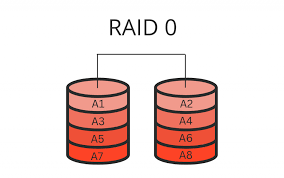

   + RAID 1: Mirrored blocks.
  
     - Cần ít nhất 2 ổ cứng.
     - Dữ liệu trên 2 ổ giống nhau.
     - Tốc độ đọc cao hơn, tốc độ ghi không thay đổi.
     - Có thể khôi phục dữ liệu khi 1 ổ fail.
     
    
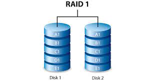

   + RAID 5: Striped & Parity blocks.
  
     - Cần ít nhất 3 ổ cứng.
     - Dữ liệu chia đều ra 3 ổ và mỗi ổ có thêm 1 khối parity (XOR của các ổ cứng khác để khôi phục dữ liệu).
     - Trong 3 ổ có 2 ổ fail thì không thể khôi phục dữ liệu.
     - Tốc độ đọc tăng, tốc độ ghi có thể giảm có thể do phải tính toán parity.
     - Có thể khôi phục dữ liệu khi 1 ổ fail.
    
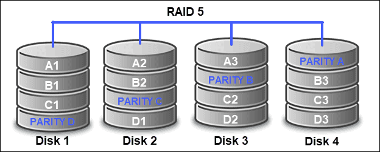
     
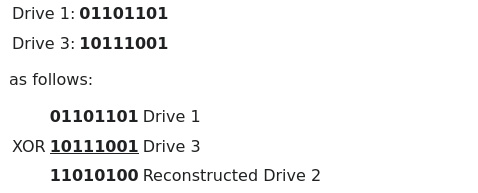


   + RAID 6: Striped & Parity blocks.

     - Giống RAID 5.
     - Cần tối thiểu 4 ổ cứng.
     - Thêm 1 partiy => có thể khôi phục dữ liệu từ 2 ổ fail.
     - Hiệu năng ghi giảm do phải tính toán 2 parity.


  + RAID 10: Mirrored RAID 0.

    - Cần tối thiểu 4 ổ cứng.
    - Kết hợp hiệu năng ghi của RAID 0 và khả năng khôi phục dữ liệu của RAID 1.
    - Dữ liệu được mirror sau đó striping.

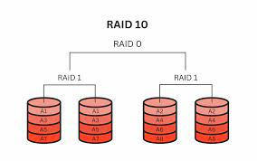


  + RAID 01: Striped RAID 1.

    - Cần tối thiểu 4 ổ cứng.
    - Ngược lại với RAID 10, dữ liệu được striping rồi mirror.

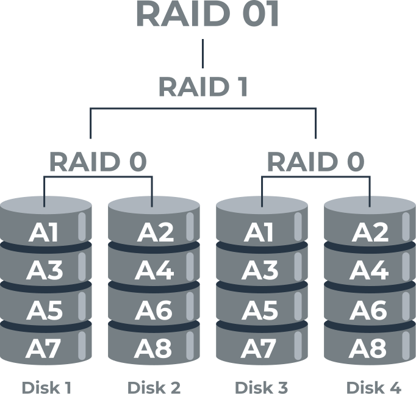


## Filesystem

1. Format

1, etx3:

- Là hệ thống tệp tin ghi nhật ký.
- Cho phép mở rộng hệ thống tệp mà không cần dừng hệ thống.
- Sử dụng HTree Indexing dễ truy cập và quản lý các thư mục lớn.

2, ext4:

- Tương thích với ext2, ext3. Cho phép nâng cấp hệ thống mà không mất dữ liệu.
- Hỗ trợ Pre-allocation dữ liệu: phân bổ trước không gian cho các tệp, đảm bảo rằng không gian sẽ được duy trì sẵn sàng cho tệp đó trong tương lai.
- Số thư mục con không giới hạn.
- Hỗ trợ checksum cho metadata để phát hiện và sửa lỗi và checksum cho journal.
- Hỗ trợ kích thước tệp lên đến 16 TB và hệ thống tệp kích thước 1 EB (Exabyte).

3, xfs:

- Là một hệ thống tệp 64-bit ghi nhật ký (journaling).
- Hỗ trợ snapshot, tạo 'hình ảnh' của hệ thống tại 1 thời điểm.
- Cho phép phân mảnh và tối ưu hóa hệ thống tệp mà không cần phải dừng hoạt động hệ thống.
- Cho phép các tệp có không gian không liên tục, chỉ tiêu thụ không gian đĩa khi thực sự cần thiết.
- Hỗ trợ hệ thống tệp có kích thước lên đến 8 exabytes và tệp có kích thước lên đến 8 exabytes.
- Tối ưu hóa cho các hoạt động I/O song song, cho phép nhiều luồng truy cập hệ thống tệp cùng lúc.
3. Ổ, partition

- Sử dụng `fdisk`:
  + Liệt kê disk và partition: `fdisk -l`
  + Chọn disk: `fdisk /dev/disk`
  + Tạo partition mới: sử dụng `n` để tạo và `w` để ghi vào disk
- Sử dụng `parted`:
  + Liệt kê disk và partition: `parted -l`
  + Chọn disk: `parted /dev/disk`
  + Tạo partition table: `mklabel [partition-table-type]`
  + Kiểm tra table: `print`
  + Tạo partition: `mkpart [partition-type] [file-system] [disk-start] [disk-end]`
  + Ghi vào disk: `quit`

- Format partition:
  + `mkfs.[file-system] [partition]`
4. LVM (Logical Volume Manager)

- Là một công cụ mạnh mẽ cho phép quản lý không gian đĩa một cách linh hoạt và động trên hệ thống Linux.
- Cho phép tạo, thay đổi kích thước, và quản lý các phân vùng đĩa một cách dễ dàng mà không cần phải tắt máy.

1, Physical Volume (PV): Là các thiết bị lưu trữ vật lý như ổ cứng, phân vùng hoặc mảng RAID

 - Xác định PV: `lsblk`
 - Tạo PV: `pvcreate /dev/partition1`
 - Xóa PV: `pvremove /dev/partition1`

2, Volume Group (VG): Là một tập hợp các PV, tạo thành một không gian lưu trữ chung để tạo ra các Logical Volume.

 - Tạo VG từ PV: `vgcreate my_vg /dev/partition1`
 - Xóa VG: `vgremove my_vg`
 - Thêm PV mới vào VG: `vgextend my_vg /dev/partition2`
 - Xóa PV khỏi VG:
   + `pvmove /dev/partition2`
   + `vgreduce my_vg /dev/partition2`
 - Kiểm tra VG: `vgdisplay`

3, Logical Volume (LV): Là các phân vùng động được tạo ra từ VG. Các LV này có thể được mở rộng hoặc thu nhỏ một cách linh hoạt.

 - Tạo LV từ VG: `lvcreate -L [size] -n my_lv my_vg`
 - Mở rộng LV:
   + `lvextend -L +[size] /dev/my_vg/my_lv`
   + `resize2fs /dev/my_vg/my_lv`
 - Thu nhỏ LV:
   + `umount /dev/my_vg/my_lv`
   + `e2fsck -f /dev/my_vg/my_lv`
   + `resize2fs /dev/my_vg/my_lv [size]`
   + `lvreduce -L [size] /dev/my_vg/my_lv`
 - Xóa LV: `lvremove /dev/my_vg/my_lv`
 - Kiểm tra LV: `lvdisplay`

4, Logical Extent (LE) và Physical Extent (PE): LE là các khối dữ liệu của LV và PE là các khối dữ liệu của PV. Các LE và PE có cùng kích thước và được ánh xạ với nhau trong VG.

5. NTFS

- Được Microsoft phát triển để thay thế FAT, FAT32.
- Hỗ trợ tệp và phân vùng lớn hơn so với FAT32 (4GB và 2TB).
- Hỗ trợ quyền truy cập và mã hóa tệp tin.
- Hỗ trợ ghi nhật ký (journaling), quản lý phân mảnh tự động,...

1, Format disk partition: 

    mkfs -t ntfs /dev/disk

2, Tạo, xóa phân vùng: sử dụng `fdisk` và `parted`.

3, Thay đổi kích thước phân vùng NTFS:

    ntfsresize --size SIZE /dev/disk

## Ceph

Ceph lưu dữ liệu dưới dạng object.

Sử dụng thuật toán CRUSH, Ceph tính toán Placement Group (PG) nào nên chứa đối tượng, OSD nào nên chứa PG.

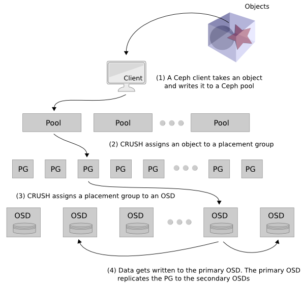

1. Cấu trúc của Ceph:

- Librados:
  + Cung cấp giao diện API để các ứng dụng có thể thực hiện các hoạt động lưu trữ như đọc, ghi và xóa đối tượng.
  + Là cầu nối giữa các ứng dụng và RADOS, giúp xử lý các yêu cầu lưu trữ mà không cần tương tác trực tiếp với các OSDs.

- Rados:
  + Quản lý lưu trữ đối tượng, bao gồm các chức năng như sao chép, phát hiện lỗi, phục hồi, và cân bằng tải.
  + Cung cấp nền tảng cho các dịch vụ lưu trữ khác như RADOS Block Device (RBD), Ceph File System (CephFS), và RADOS Gateway (RGW).
  + Bao gồm OSD Daemon và các CRUSH map - quản lý cách phân phối các đối tượng đến các OSDs.

- Rados Gateway (RGW): dịch vụ lưu trữ đối tượng của Ceph
  + Tương thích với S3 của Amazon và Swift của Openstack.
  + Cung cấp các dịch vụ lưu trữ đối tượng qua API, cho phép các ứng dụng lưu trữ và truy xuất dữ liệu đối tượng.
  + Hỗ trợ các tính năng như bucket-nhóm các obj với nhau, object versioning, và object lifecycle management-tự động sao chép,xóa,....

--> Ceph Object Storage bao gồm Ceph Cluster và Rados Gateway.

- Ceph Block Device (RBD): dịch vụ lưu trữ khối của Ceph
  + Cung cấp các thiết bị lưu trữ khối cho các máy ảo, hệ thống tệp, và các ứng dụng khác yêu cầu lưu trữ khối.
  + Hỗ trợ các tính năng như snapshot, cloning và việc mở rộng khối.

- Ceph FileSystem (CephFS): hệ thống tệp phân tán của Ceph
  + Cung cấp dịch vụ lưu trữ tệp với khả năng mở rộng và phân tán trên nhiều máy chủ.
  + Sử dụng các OSD (Object Storage Daemons) để lưu trữ dữ liệu và MDS (Metadata Servers) để quản lý siêu dữ liệu.

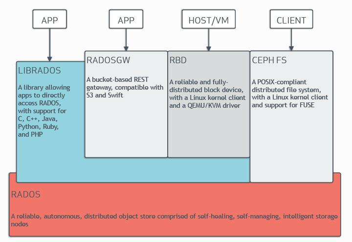

2. Lưu dữ liệu

- Ceph Cluster nhận dữ liệu từ Ceph Client - dữ liệu có thể đến từ RBD, CephFS, Ceph Object Storage hoặc tự triển khai bằng librados.
- Dữ liệu này được lưu dưới dạng RADOS object.
- Mỗi object lưu ở OSD.
- Ceph OSD Daemon lưu dữ liệu như object trong 1 không gian phẳng (flat namespace). Object bao gồm ID, binary và metadata bao gồm cặp name/value.
  + ID: định danh duy nhất trong toàn bộ cluster.
  + Binary: Dữ liệu nhị phân mà đối tượng lưu trữ.
  + Metadata: Cung cấp các thông tin như loại đối tượng, ngày tạo, người tạo, ...

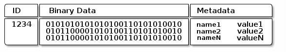

3. Thành phần của Ceph Cluster:

- Để Ceph Cluster có thể hoạt động cần tối thiểu 1 Ceph Monitor, 1 Ceph Manager và cần ít nhất số lượng OSD bằng số lượng bản sao obj lưu trong cluster.

- Cấu trúc:

  + Ceph Monitor (MON):
    - Duy trì các đồ thị trạng thái của cluster, bao gồm monitor map, manager map, OSD map, MDS map, và CRUSH map.
    - Các đồ thị này cần thiết để các Ceph daemons phối hợp với nhau, quản lý xác thực giữa daemons và clients.
    - Cần ít nhất 3 MON để đảm bảo HA.

  + Ceph Manager (Mgr):
    - Chịu trách nhiệm theo dõi các số liệu thời gian chạy và trạng thái hiện tại của cụm Ceph, bao gồm việc sử dụng bộ nhớ, số liệu hiệu suất hiện tại và tải hệ thống.
    - Chứa python-based module để quản lý và expose thông tin cụm Ceph.
    - Cần ít nhất 2 Mgr để đảm bảo bảo HA.

  + Ceph OSDs (OSD):
    - Lưu trữ dữ liệu, xử lý sao chép, phục hồi, cân bằng lại dữ liệu.
    - Cung cấp thông tin giám sát cho MONs và Mgrs bằng cách kiểm tra heartbeat các OSD khác.
    - Thường cần 3 OSD để đảm bảo HA.

  + Ceph Metadata Server (MDS):
    - Cần thiết nếu sử dụng CephFS.
    - Cho phép CephFS chạy các lệnh như ls, find,... mà không đặt gánh nặng lên Ceph Cluster.

4. Cờ trạng thái Cluster:

- Dùng để kiểm soát hành vi của cluster khi đang thực hiện bảo trì hoặc khi bạn cần ngăn chặn các hoạt động tự động nhất định trong cluster.

| Flags | Chức năng |
| --- | --- |
| noout | Khi cờ này được bật, Ceph sẽ không di chuyển dữ liệu ra khỏi các OSD bị đánh dấu là "down" hoặc "out" |
| norebalance | Ngăn không cho Ceph thực hiện quá trình cân bằng lại dữ liệu giữa các OSDs khi thêm,xóa,... OSDs |
| norecovery | Ngăn không cho Ceph thực hiện quá trình khôi phục dữ liệu khi OSDs quay trở lại sau khi đã bị down hoặc mất kết nối |
| nobackfill | Ngăn không cho Ceph đẩy dữ liệu đến các OSD mới hoặc các OSD đã quay trở lại sau khi chúng đã bị mất dữ liệu |
| nodown | Ngăn Ceph đánh dấu OSD là "down" khi không nhận được thông tin từ OSD đó |
| noin | Ngăn Ceph tự động đưa một OSD trở lại trạng thái "in" khi OSD đó quay lại trạng thái "up" sau khi đã bị down |
| pause | Tạm dừng toàn bộ hoạt động của cụm Ceph |
| full | Ngăn việc ghi dữ liệu mới khi dung lượng OSD đã đạt đến giới hạn |

- Kiểm tra trạng thái cờ của cluster: `ceph osd dump | grep flags`

5. Cluster Map:

- Để Ceph Cluster hoạt động bình thường, Ceph Clients và OSDs phải biết được thông tin tình trạng cluster. Thông tin đó được lưu trũ trong Cluster Map.

- Bao gồm:
  + Monitor Map:
    - Chứa fsid của cluster, vị trí, tên, địa chỉ, TCP port của mỗi monitor.
    - Chứa thông tin epoch (kỷ nguyên), thời gian tạo và lần cuối chỉnh sửa monitor map.
    - `ceph mon dump`
  + OSD Map:
    - Chứa fsid của cluster.
    - Chứa thời gian tạo và lần cuối chỉnh sửa OSD map.
    - Chứa danh sách pool, kích thước bản sao, số lượng PG, OSDs và trạng thái (`up`, `in`).
    - `ceph osd dump`
  + PG Map:
    - Chứa phiên bản PG và mốc thời gian.
    - Chứa epoch gần nhất của OSD map.
    - Chứa tỷ lệ đầy đủ, chi tiết của từng PG - ID, Up Set, Acting Set, trạng thái của PG và thống kê sử dụng dữ liệu của từng pool.
  + CRUSH Map:
    - Chứa danh sách thiết bị lưu trữ, cấu trúc phân cấp của domain lỗi và các quy tắc để duyệt qua cấu trúc phân cấp khi lưu trữ dữ liệu.
    - `ceph osd getcrushmap -o {filename}`, `crushtool -d {comp-crushmap-filename} -o {decomp-crushmap-filename}`
  + MDS Map:
    - epoch hiện tại của MDS Map, thời gian tạo và lần cuối chỉnh sủa của nó.
    - Chứa pool để lưu thông tin metadata, danh sách metadata servers, và metadata servers `up` hay `in`.
    - `ceph fs dump`

- Mỗi map chứa lịch sử thay đổi trạng thái của nó.
- Ceph Monitors có bản copy master của Cluster Map - bao gồm cluster members, trạng thái của cluster, thay đổi của cluster, thông tin tổng quan về health của Ceph Storage Cluster.

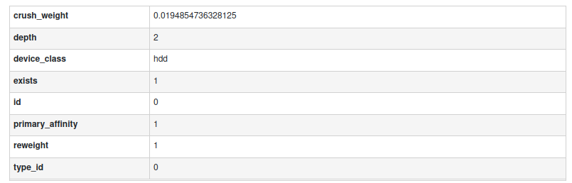

6. Pool:

- Là các phân vùng logic để lưu trữ object.

- Có type:
  + replicated:
    - Lưu trữ nhiều bản sao của mỗi object trên các OSD khác nhau. Số lượng bản sao được định nghĩa bởi cấu hình của pool.
    - Tốn nhiều bộ nhớ.
    - Hỗ trợ tất cả các tính năng của Ceph.
  + erasure:
    - phân phối dữ liệu trên nhiều OSD theo cách cho phép tái tạo dữ liệu từ một tập hợp các chunk.
    - Tốn ít bộ nhớ hơn replicated pool.
    - Hiệu suất đọc ghi kém hơn do phải tính toán việc mã hóa và giải mã dữ liệu.
    - Một số tính năng của Ceph có thể không được hỗ trợ như snapshot, quota,...

- Cung cấp:
  + Khả năng chịu lỗi: bằng cách cho phép thiết lập số lượng OSD có thể hỏng mà không làm mất dữ liệu.
      - Nếu sử dụng replicated pool thì số OSD có thể fail mà không mất dữ liệu bằng với số bản sao.
  + Placement Groups: autoscaler cài số PG trong 1 pool. Trong cấu hình thông thường 100 PG/pool.
  + Crush rules: Khi dữ liệu lưu trong 1 pool, vị trí của object và bản sao của nó trong cluster được xác định bởi CRUSH rules.
  + Snapshots: Tạo snapshot của 1 pool.

7. PG:

- Giúp phân phối và quản lý dữ liệu trên OSD 1 cách hiệu quả.
- Dữ liệu được ánh xạ vào PG, các PG được ánh xạ vào OSD. --> Gộp được các object, giảm metadata mỗi object cần theo dõi và lượng quy trình cần chạy.
- Tăng số lượng PG có thể giảm sai lệch về tải mỗi OSD trong cluster nhưng cần nhiều CPU và memory hơn.
- Tính: PGs=(OSDs×100)/replica size
- Trạng thái của PG:
*"backfill" là một quá trình dùng để đảm bảo tính dư thừa và cân bằng dữ liệu trên toàn bộ cụm lưu trữ

| status | Chi tiết |
| --- | --- |
| creating | PG đang được tạo |
| active | PG active sẵn sàng xử lý các request của client đọc ghi cập nhật ... |
| activating | PG đang peer nhưng chưa active |
| clean | Các bản ghi replicate đúng vị trí và đủ số lượng |
| down | bản sao với dữ liệu quan trọng down, PG không sẵn sàng xử lý các request |
| peering | PG đang trong quá trình phối hợp giữa các OSD để đảm bảo sự nhất quán của dữ liệu |
| degraded | thiếu bản sao của 1 số object trong PG, có thể do OSD bị lỗi |
| inconsistent | bản sao của PG không đồng nhất (kích thước của object sai, thiếu object từ 1 bản sao sau quá trình khôi phục |
| repair | đang kiểm tra PG và sẽ sửa không đồng nhất nếu có thể |
| failed_repair | nỗ lực sửa chữa PG đã thất bại. Cần có sự can thiệp thủ công |
| recovering | các object đang được migrate/đồng bộ hóa với các bản sao |
| recovery_toofull | khôi phục thất bại vì OSD quá đầy |
| recovery_wait | đợi khôi phục |
| recovery_unfound | không thể khôi phục vì không tìm thấy object |
| forced_recovery | PG được để độ ưu tiên cao nhất để khôi phục |
| incomplete | PG thiếu 1 phần lịch sử của log, nếu gặp có thể khởi động lại OSD chứa thông tin cần thiết |
| stale | PG ở trạng thái không biết- monitor không nhận được cập nhật từ khi PG mapping thay đổi |
| remapped | PG tạm thời map đến OSD khác với CRUSH chỉ định |
| peered | PG đã peer nhưng không thể active |
| backfilling | trường hợp đặc biệt của khôi phục, toàn bộ dữ liệu PG được quét và đồng bộ thay vì suy luận từ những gì cần chuyển từ log hoạt động PG gần nhất |
| backfill_unfound | backfill không thể hoàn thành vì không tìm thấy object |
| backfill_wait | PG đang đợi backfill |
| backfill_toofull | OSD quá đầy, backfill từ chối |
| forced_backfill | PG được để độ ưu tiên cao nhất để backfill |
| premerge | PG ở trạng thái không hoạt động-IO do sắp hợp nhất PG. Điều đó xảy ra khi pg_num_pending < pg_num và áp dụng cho các PG có pg_num_pending <= ps < pg_num cũng như PG ngang hàng tương ứng mà nó đang hợp nhất |
| scrubbing | PG đang được kiểm tra không đồng nhất |
| deep | kết hợp với `scrubbing` báo hiệu là deep scrub |
| undersized | PG không chọn đủ OSD vì kích thước của nó |
| snaptrim | PG xóa các snapshot cũ |
| snaptrim_wait | PG trong hàng chờ dọn snapshot |
| snaptrim_error | lỗi trong quá trình dọn snapshot |

Thường sẽ có 2 trạng thái kết hợp để phản ánh trạng thái của cluster. 

Ví dụ khi 1 OSD bị lỗi: `active+degraded` (số lượng trạng thái không đủ) --> Cluster cố khôi phục `active+recovery` --> khôi phục thành công `active+clean`.

8. CRUSH Map

- CRUSH algorithm tính toán vị trí storage để quyết định cách để lưu trữ và truy xuất dữ liệu.
- CRUSH cho phép Ceph Clients giao tiếp trực tiếp với OSDs. Bằng cách sử dụng phương pháp lưu trữ và truy xuất dữ liệu xác định bằng thuật toán, Ceph tránh được single point of failure, tắc nghẽn hiệu suất và giới hạn vật lý để mở rộng.
- CRUSH sử dụng map của cluster để map dữ liệu đến OSDs, phân phối dữ liệu trên cluster theo cấu hình chính sách sao chép và failure domain. 
- CRUSH map chứa danh sách OSDs và phân cấp "buckets" (host, rack) và quy tắc quản lý cách CRUSH sao chép trong cluster pool.
- Bằng cách phản ánh tổ chức vật lý của quá trình cài đặt, CRUSH có thể lập mô hình (từ đó giải quyết) khả năng xảy ra lỗi.
- Cấu trúc phân cấp của CRUSH:
  + chassis
  + racks
  + physical proximity
  + shared power source
  + shared networking
  + failure domains

--> Bằng cách mã hóa thông tin này vào bản đồ CRUSH, các chính sách đặt dữ liệu của CRUSH sẽ phân phối các bản sao của object qua các miền lỗi khác nhau trong khi vẫn duy trì sự phân phối mong muốn.

- Khi 1 OSD mới được triển khai, nó được tự thêm vào CRUSH map trong `host bucket` có tên node OSD chạy trên đó.

--> Kết hợp với cấu hình domain failure đảm bảo bản sao hoặc phân đoạn erasure-code phân phối giữa các host và 1 host lỗi hoặc các lỗi khác không ảnh hưởng tính khả dụng.

- Thay đổi CRUSH map:
  + Lấy thông tin CRUSH map: `ceph osd getcrushmap -o {compiled-crushmap-filename}`
  + Decompile CRUSH map: `crushtool -d {compiled-crushmap-filename} -o {decompiled-crushmap-filename}`
  + Compile CRUSH map: `crushtool -c {decompiled-crushmap-filename} -o {compiled-crushmap-filename}`
  + Cài đặt CRUSH map sử dụng file compile: `ceph osd setcrushmap -i {compiled-crushmap-filename}`

- Vị trí của OSD trong hệ thống phân cấp của CRUSH map được gọi là `CRUSH location`. Nó có dạng danh sách key/value `root=default row=a rack=a2 chassis=a2a host=a2a1`

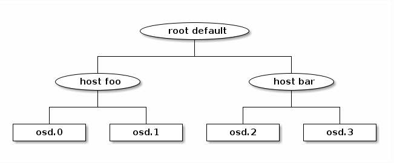

- Mỗi node (thiết bị - OSD có lưu dữ liệu hoặc bucket) trong cấu trúc phân cấp có `weight` chỉ ra tỷ lệ tương đối của tổng dữ liệu cần được lưu trữ bởi thiết bị hoặc cây phân cấp. `weight` được cài đặt ở leaves biểu thị kích thước của thiết bị. Các `weight` tự động cộng dồn từ dưới lên trên: `weight` của root = tổng `weight` thiết bị bên dưới. `weight` thường hiển thị TiB.

- weight set: có thể thay thế weight trong việc tính toán đặt dữ liệu.
  + `compat weight`: là 1 cặp weight cho mỗi thiết bị và mỗi node trong cluster.
    - không thể khắc phục tất cả các bất thường (PG trong pool khác nhau có size, mức tải khác nhau nhưng xử lý như nhau bởi balancer).
    - ưu điểm tương thích ngược với các phiên bản Ceph.
  + `per-pool weight`: linh hoạt hơn vì nó cho phép tối ưu hóa việc đặt dữ liệu cho mỗi pool
    - có thể được điều chỉnh cho từng vị trí của việc đặt dữ liệu cho phép trình tối ưu hóa điều chỉnh độ lệch nhỏ của dữ liệu đối với các thiết bị có trọng số nhỏ so với các thiết bị ngang hàng của chúng (hiệu ứng thường chỉ rõ ràng trong các cụm rất lớn nhưng có thể gây ra vấn đề về cân bằng).

- Nếu cả `compat weight` và `per-pool weight` được cài đặt thì vị trí dữ liệu của 1 pool sẽ sử dụng `per-pool weight`.

- Ví dụ:

```
Compat Weight Set

Giả sử bạn có một cụm Ceph với các OSD sau và muốn sử dụng bộ trọng số compat để cân bằng:

    OSD1: Trọng số gốc 1 TiB
    OSD2: Trọng số gốc 2 TiB
    OSD3: Trọng số gốc 3 TiB

Bộ trọng số compat có thể điều chỉnh như sau để cải thiện cân bằng dữ liệu:

    OSD1: Trọng số compat 1.2 TiB
    OSD2: Trọng số compat 2.1 TiB
    OSD3: Trọng số compat 2.7 TiB

Per-Pool Weight Set

Trong trường hợp bạn có nhiều pool dữ liệu với các yêu cầu khác nhau, bộ trọng số per-pool có thể được sử dụng để tối ưu hóa từng pool:

    Pool1:
        OSD1: Trọng số 1.5 TiB
        OSD2: Trọng số 2.0 TiB
        OSD3: Trọng số 2.5 TiB
    Pool2:
        OSD1: Trọng số 1.0 TiB
        OSD2: Trọng số 1.5 TiB
        OSD3: Trọng số 3.0 TiB
```


### Cài đặt Ceph Cluster

- Tại node 1:
  + `ssh-keygen`
  + `ssh-copy-id node02` && `ssh-copy-id node03`
  + `for NODE in node01 node02 node03 do ssh $NODE "apt update; apt -y install ceph" done`
  + `uuidgen`
- Cấu hình `/etc/ceph/ceph.conf` tại 3 node:

```
[global]
# specify cluster network for monitoring
cluster network = <dải mạng>
# specify public network
public network = <dải mạng>
# specify UUID genarated above
fsid = <kết quả uuidgen>
# specify IP address of Monitor Daemon
mon host = node01,node02,node03
# specify Hostname of Monitor Daemon
mon initial members = <tên 3 node>
osd pool default crush rule = -1

# mon.(Node name)
[mon.node01]
# specify Hostname of Monitor Daemon
host = node01
# specify IP address of Monitor Daemon
mon addr = <ip>
# allow to delete pools
mon allow pool delete = true

# mon.(Node name)
[mon.node02]
# specify Hostname of Monitor Daemon
host = node02
# specify IP address of Monitor Daemon
mon addr = <ip>
# allow to delete pools
mon allow pool delete = true

# mon.(Node name)
[mon.node03]
# specify Hostname of Monitor Daemon
host = node03
# specify IP address of Monitor Daemon
mon addr = <ip>
# allow to delete pools
mon allow pool delete = true
```

- Tại node 1:
  + Tạo key cho cluster mon: `ceph-authtool --create-keyring /etc/ceph/ceph.mon.keyring --gen-key -n mon. --cap mon 'allow *'`
  + Tạo key cho cluster admin: `ceph-authtool --create-keyring /etc/ceph/ceph.client.admin.keyring --gen-key -n client.admin --cap mon 'allow *' --cap osd 'allow *' --cap mds 'allow *' --cap mgr 'allow *'`
  + Tạo key boootstrap: `ceph-authtool --create-keyring /var/lib/ceph/bootstrap-osd/ceph.keyring --gen-key -n client.bootstrap-osd --cap mon 'profile bootstrap-osd' --cap mgr 'allow r'`
  + Import các key vừa tạo: `ceph-authtool /etc/ceph/ceph.mon.keyring --import-keyring /etc/ceph/ceph.client.admin.keyring` && `ceph-authtool /etc/ceph/ceph.mon.keyring --import-keyring /var/lib/ceph/bootstrap-osd/ceph.keyring `
  + Tạo mon map trên node01: `monmaptool --create --add node01 <ip> --fsid <kết quả uuidgen> /etc/ceph/monmap`
  + Thêm 2 mon vào map vừa tạo: `monmaptool --add node02 <ip> --fsid <kết quả uuidgen> /etc/ceph/monmap` && `monmaptool --add node03 <ip> --fsid <kết quả uuidgen> /etc/ceph/monmap`
- Tạo thư mục cho mon daemon trên cả 3 node: `mkdir /var/lib/ceph/mon/ceph-node0x`
- Copy mon key, monmap tạo trên node01 vào 2 node còn lại: `scp /etc/ceph/ceph.mon.keyring root@node0x:/etc/ceph/ceph.mon.keyring` && `scp /etc/ceph/monmap root@node02:/etc/ceph/monmap`
- Liên kết key và monmap với mon daemon: `ceph-mon --cluster ceph --mkfs -i node0x --monmap /etc/ceph/monmap --keyring /etc/ceph/ceph.mon.keyring`
- Đổi quyền cho thư mục: `chown ceph. /etc/ceph/ceph.*` && `chown -R ceph. /var/lib/ceph/mon/ceph-node0x /var/lib/ceph/bootstrap-osd`
- Enable ceph mon: `systemctl enable --now ceph-mon@node0x`
- Enable các module: `ceph mgr enable ...` && `ceph mon enable ...`
- Tạo thư mục cho Manager Deamon: `mkdir /var/lib/ceph/mgr/ceph-node0x`
- Tạo key auth: `ceph auth get-or-create mgr.node0x mon 'allow profile mgr' osd 'allow *' mds 'allow *'`
- Thêm key vừa tạo: `ceph auth get-or-create mgr.node0x | tee /etc/ceph/ceph.mgr.admin.keyring` && `cp /etc/ceph/ceph.mgr.admin.keyring /var/lib/ceph/mgr/ceph-node0x/keyring`
- Đổi quyền thư mục mgr key: `chown ceph. /etc/ceph/ceph.mgr.admin.keyring ` && `chown -R ceph. /var/lib/ceph/mgr/ceph-node0x`
- Restart ceph mon: `systemctl enable --now ceph-mgr@node0x`
- Kiểm tra ceph: `ceph -s`

```
cluster:
    id:     <id>
    health: HEALTH_WARN
            mons are allowing insecure global_id reclaim
            OSD count 0 < osd_pool_default_size 3

  services:
    mon: 3 daemons, quorum node02,node01,node03 (age 51m)
    mgr: node01(active, since 18m), standbys: node03, node02
    osd: 0 osds: 0 up, 0 in

  data:
    pools:   0 pools, 0 pgs
    objects: 0 objects, 0 B
    usage:   0 B used, 0 B / 0 B avail
    pgs:v
```

- Format ổ ceph: `parted --script /dev/vdb 'mklabel gpt'` && `parted --script /dev/sdb "mkpart primary 0% 100%"`
- Tạo ceph volume: `ceph-volume lvm create --data /dev/vdb1`
- Kiểm tra ceph:

```
cluster:
    id:     <id>
    health: HEALTH_WARN
            mons are allowing insecure global_id reclaim

  services:
    mon: 3 daemons, quorum node02,node01,node03 (age 20h)
    mgr: node01(active, since 19h), standbys: node03, node02
    osd: 3 osds: 3 up (since 14m), 3 in (since 14m)

  data:
    pools:   1 pools, 1 pgs
    objects: 0 objects, 0 B
    usage:   3.0 GiB used, 57 GiB / 60 GiB avail
    pgs:     1 active+clean

ID  CLASS  WEIGHT   TYPE NAME                   STATUS  REWEIGHT  PRI-AFF
-1         0.05846  root default
-3         0.01949      host ops-dungnt-node01
 0    hdd  0.01949          osd.0                   up   1.00000  1.00000
-5         0.01949      host ops-dungnt-node02
 1    hdd  0.01949          osd.1                   up   1.00000  1.00000
-7         0.01949      host ops-dungnt-node03
 2    hdd  0.01949          osd.2                   up   1.00000  1.00000
```

- Enable dashboard:
  + `ceph dashboard create-self-signed-cert`
  + `ceph dashboard ac-user-create <user> -i <password_file> administrator`
  + `ceph mgr services`
  + `ceph config set mon auth_allow_insecure_global_id_reclaim false`

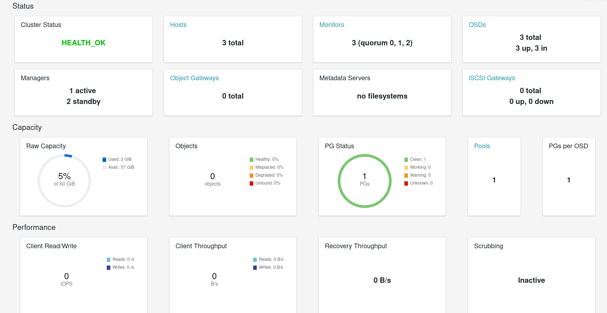


##### Thêm OSD vào cluster

- Copy ceph config và key:
  + `scp /etc/ceph/ceph.conf node0x:/etc/ceph/ceph.conf`
  + `scp /etc/ceph/ceph.client.admin.keyring node0x:/etc/ceph`
  + `scp /var/lib/ceph/bootstrap-osd/ceph.keyring node0x:/var/lib/ceph/bootstrap-osd`
- Cấu hình OSD tại node mới:
  + `chown ceph. /etc/ceph/ceph.* /var/lib/ceph/bootstrap-osd/*`
  + `parted --script /dev/vdb 'mklabel gpt'`
  + `parted --script /dev/vdb "mkpart primary 0% 100%"`
  + `ceph-volume lvm create --data /dev/vdb1"`

##### Xóa OSD khỏi cluster

- Đánh dấu OSD cần xóa: `ceph osd out <id>`
- Theo dõi trạng thái của cluster: `ceph -w`
- Dừng ceph tại node xóa: `systemctl disable --now ceph-osd@nodex.service`
- Xóa OSD: `ceph osd purge <id> --yes-i-really-mean-it `


##### Sử dụng Block Device

- Tạo default RBD pool với 128 PG: `ceph osd pool create rbd 128`
- Enable PG auto scale cho pool: `ceph osd pool set rbd pg_autoscale_mode on`
- Initialize the pool: `rbd pool init rbd`
- Kiểm tra trạng thái autoscale pool: `ceph osd pool autoscale-status`

```
POOL                     SIZE  TARGET SIZE  RATE  RAW CAPACITY   RATIO  TARGET RATIO  EFFECTIVE RATIO  BIAS  PG_NUM  NEW PG_NUM  AUTOSCALE
device_health_metrics      0                 3.0        61428M  0.0000                                  1.0       1              on
rbd                       19                 3.0        61428M  0.0000                                  1.0      32              on
```

- Tạo block device 10G: `rbd create --size 10G --pool rbd rbd01`
- Kiểm tra block device: `rbd ls -l`
- Map block device: `rbd map rbd01`
- Xác nhận: `rbd showmapped`
- Format thiết bị: `mkfs.xfs /dev/rbd0`
- Mount partion: `mount /dev/rbd0 /tmp/temp`
- Kiểm tra partion vừa mount: `df -hT`

###### Xóa Block Device:

- Unmount partion của block device: `rbd unmap /dev/rbd/rbd/rbd01`
- Xóa block device: `rbd rm rbd01 -p rbd`
- Xóa pool rbd: `ceph osd pool delete rbd rbd --yes-i-really-really-mean-it`


###### Giả lập 1 node down

- Stop ceph service tại 1 node: `systemctl stop ceph-osd@<osd-id>`
- Kiểm tra trạng thái của osd, ceph: `ceph osd tree` && `ceph -s`

```
ID  CLASS  WEIGHT   TYPE NAME                   STATUS  REWEIGHT  PRI-AFF
-1         0.05846  root default
-3         0.01949      host ops-dungnt-node01
 0    hdd  0.01949          osd.0                   up   1.00000  1.00000
-5         0.01949      host ops-dungnt-node02
 1    hdd  0.01949          osd.1                 down   1.00000  1.00000
-7         0.01949      host ops-dungnt-node03
 2    hdd  0.01949          osd.2                   up   1.00000  1.00000

cluster:
    id:     773c6f4e-e3d3-47d4-9e17-c3f42c84cfca
    health: HEALTH_WARN
            1 osds down
            1 host (1 osds) down
            Degraded data redundancy: 24/72 objects degraded (33.333%), 17 pgs degraded, 33 pgs undersized

  services:
    mon: 3 daemons, quorum node02,node01,node03 (age 43h)
    mgr: node01(active, since 18h), standbys: node02, node03
    osd: 3 osds: 2 up (since 11m), 3 in (since 23h)

  data:
    pools:   2 pools, 33 pgs
    objects: 24 objects, 15 MiB
    usage:   3.2 GiB used, 57 GiB / 60 GiB avail
    pgs:     24/72 objects degraded (33.333%)
             17 active+undersized+degraded
             16 active+undersized
```

- Tạo image lưu dữ liệu cho 2 node còn lại: `rbd create test --size 10000 --pool rbd`
- Kiểm tra dữ liệu trên: `ceph osd status`

```
ID  HOST                USED  AVAIL  WR OPS  WR DATA  RD OPS  RD DATA  STATE
 0  ops-dungnt-node01  1097M  18.9G      0        0       0        0   exists,up
 1  ops-dungnt-node02     0      0       0        0       0        0   autoout,exists
 2  ops-dungnt-node03  1097M  18.9G      0        0       0        0   exists,up
```

- Up lại node vừa down: `systemctl start ceph-osd@<osd-id>`

```
ID  HOST                USED  AVAIL  WR OPS  WR DATA  RD OPS  RD DATA  STATE
 0  ops-dungnt-node01  1097M  18.9G      0        0       0        0   exists,up
 1  ops-dungnt-node02  1097M  18.9G      0        0       0        0   exists,up
 2  ops-dungnt-node03  1097M  18.9G      0        0       0        0   exists,up

cluster:
    id:     <id>
    health: HEALTH_OK

  services:
    mon: 3 daemons, quorum node02,node01,node03 (age 43h)
    mgr: node01(active, since 18h), standbys: node02, node03
    osd: 3 osds: 3 up (since 9s), 3 in (since 9s)

  data:
    pools:   2 pools, 33 pgs
    objects: 30 objects, 15 MiB
    usage:   3.2 GiB used, 57 GiB / 60 GiB avail
    pgs:     33 active+clean

  io:
    recovery: 94 B/s, 2 keys/s, 0 objects/s
```


###### Giả lập 2 node down

- Stop ceph service tại 2 node: `systemctl stop ceph-osd@<ceph-id>`

- Kiểm tra trạng thái của osd, ceph: `ceph osd tree` && `ceph -s`

```
ID  CLASS  WEIGHT   TYPE NAME                   STATUS  REWEIGHT  PRI-AFF
-1         0.05699  root default
-3         0.01900      host ops-dungnt-node01
 0    hdd  0.01900          osd.0                   up   1.00000  1.00000
-5         0.01900      host ops-dungnt-node02
 1    hdd  0.01900          osd.1                 down   1.00000  1.00000
-7         0.01900      host ops-dungnt-node03
 2    hdd  0.01900          osd.2                 down   1.00000  1.00000

cluster:
    id:     773c6f4e-e3d3-47d4-9e17-c3f42c84cfca
    health: HEALTH_WARN
            2 osds down
            2 hosts (2 osds) down
            Reduced data availability: 33 pgs inactive
            Degraded data redundancy: 236/354 objects degraded (66.667%), 31 pgs degraded, 33 pgs undersized

  services:
    mon: 3 daemons, quorum node02,node01,node03 (age 31m)
    mgr: node01(active, since 5d), standbys: node02, node03
    osd: 3 osds: 1 up (since 2m), 3 in (since 4d)

  data:
    pools:   2 pools, 33 pgs
    objects: 118 objects, 266 MiB
    usage:   3.9 GiB used, 56 GiB / 60 GiB avail
    pgs:     100.000% pgs not active
             236/354 objects degraded (66.667%)
             31 undersized+degraded+peered
             2  undersized+peered
```

--> Các quá trình lấy dữ liệu khác chậm, không thể ghi dữ liệu mới

--> Chuyển size cluster về 1: `ceph osd pool set rbd size 1`, out các node down nếu chưa out --> Hoạt động được

- Tạo dữ liệu `

```
rbd create test3 --size 10000 --pool rbd
rbd map test3 --pool rbd
mkfs.ext4 /dev/rbd/rbd/test3
mkdir /mnt/test3
mount /dev/rbd/rbd/test3 /mnt/test3
dd if=/dev/zero of=/mnt/test3/myfile bs=1G count=1
```

- Kiểm tra dữ liệu: `ceph osd status`

```
ID  HOST                USED  AVAIL  WR OPS  WR DATA  RD OPS  RD DATA  STATE
 0  ops-dungnt-node01  1504M  18.5G      0        0       0        0   exists,up
 1  ops-dungnt-node02     0      0       0        0       0        0   autoout,exists
 2  ops-dungnt-node03     0      0       0        0       0        0   exists
```

- Up lại các node down: `systemctl start ceph-osd@<osd-id>`, thêm lại các node đánh dấu out `ceph osd in <ceph-id>`

- Kiểm tra lại các node: `ceph -s` && `ceph osd tree`

```
ID  HOST                USED  AVAIL  WR OPS  WR DATA  RD OPS  RD DATA  STATE
 0  ops-dungnt-node01  1221M  18.8G      0        0       0        0   exists,up
 1  ops-dungnt-node02  1212M  18.8G      0        0       0        0   exists,up
 2  ops-dungnt-node03  1265M  18.7G      0        0       0        0   exists,up

cluster:
    id:     773c6f4e-e3d3-47d4-9e17-c3f42c84cfca
    health: HEALTH_WARN
            1 pool(s) have no replicas configured

  services:
    mon: 3 daemons, quorum node02,node01,node03 (age 4m)
    mgr: node01(active, since 5d), standbys: node02, node03
    osd: 3 osds: 3 up (since 104s), 3 in (since 75s)

  data:
    pools:   2 pools, 33 pgs
    objects: 178 objects, 435 MiB
    usage:   3.6 GiB used, 56 GiB / 60 GiB avail
    pgs:     33 active+clean

```

--> Dữ liệu hồi phụcphục

###### Di chuyển OSD trong CRUSH map

- Lấy crush map hiện tại: `ceph osd getcrushmap -o crushmap`

- Giải mã crush map: `crushtool -d crushmap -o crushmap.txt`

```
# buckets
host ops-dungnt-node01 {
        id -3           # do not change unnecessarily
        id -4 class hdd         # do not change unnecessarily
        # weight 0.019
        alg straw2
        hash 0  # rjenkins1
        item osd.0 weight 0.019
}
host ops-dungnt-node02 {
        id -5           # do not change unnecessarily
        id -6 class hdd         # do not change unnecessarily
        # weight 0.019
        alg straw2
        hash 0  # rjenkins1
        item osd.1 weight 0.019
}
host ops-dungnt-node03 {
        id -7           # do not change unnecessarily
        id -8 class hdd         # do not change unnecessarily
        # weight 0.019
        alg straw2
        hash 0  # rjenkins1
        item osd.2 weight 0.019
}
```

- Thay đổi weight trong 1 node:

```
host ops-dungnt-node02 {
        id -5           # do not change unnecessarily
        id -6 class hdd         # do not change unnecessarily
        # weight 0.019
        alg straw2
        hash 0  # rjenkins1
        item osd.1 weight 0.025
}

host ops-dungnt-node03 {
        id -7           # do not change unnecessarily
        id -8 class hdd         # do not change unnecessarily
        # weight 0.019
        alg straw2
        hash 0  # rjenkins1
        item osd.2 weight 0.03
}
```

- Mã hóa lại crush map: `crushtool -c crushmap.txt -o new-crushmap`

- Tải crush map mới lên cluster: `ceph osd setcrushmap -i new-crushmap`

- Kiểm tra lại cluster: `ceph osd tree`

```
ID  CLASS  WEIGHT   TYPE NAME                   STATUS  REWEIGHT  PRI-AFF
-1         0.05699  root default
-3         0.01900      host ops-dungnt-node01
 0    hdd  0.01900          osd.0                   up   1.00000  1.00000
-5         0.01900      host ops-dungnt-node02
 1    hdd  0.02499          osd.1                   up   1.00000  1.00000
-7         0.01900      host ops-dungnt-node03
 2    hdd  0.03000          osd.2                   up   1.00000  1.00000
```

--> Ceph sẽ lưu trữ nhiều dữ liệu hơn trên osd.2

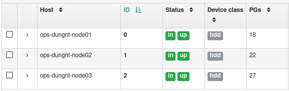

- Tạo dữ liệu mới và kiểm tra: `ceph osd status`

```
ID  HOST                USED  AVAIL  WR OPS  WR DATA  RD OPS  RD DATA  STATE
 0  ops-dungnt-node01  1094M  18.9G      0        0       0        0   exists,up
 1  ops-dungnt-node02  1096M  18.9G      0        0       0        0   exists,up
 2  ops-dungnt-node03  1101M  18.9G      0        0       0        0   exists,up
```
