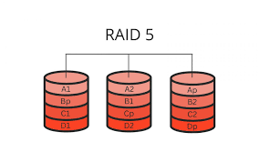

# CEPH

## RAID

1. Khái niệm:

    + Là lưu cùng 1 dữ liệu vào nhiều đĩa ổ cứng, cho phép các hoạt động đọc-ghi dữ liệu đồng thời, tăng hiệu năng, tăng MTBF(trung bình thời gian bị lỗi của phần cứng).
 
    + RAID phần cứng: sử dụng một bộ điều khiển RAID chuyên dụng, thường là một card RAID gắn vào bo mạch chủ hoặc tích hợp trực tiếp trên bo mạch chủ.

        - Hiệu suất cao hơn, không phụ thuộc vào CPU.
        - Thường có các tính năng bảo vệ dữ liệu tốt hơn, như pin-backed cache (bộ nhớ đệm có pin dự phòng) hoặc hot swap (thay nóng ổ đĩa).
        - Chi phí cao hơn.
        - Nếu bộ điều khiển hỏng => khó khôi phục dữ liệu.
 
    + RAID phần mềm: sử dụng phần mềm trong hệ điều hành (CPU) để quản lý và xử lý các hoạt động RAID.

        - Được chia làm nhiều loại RAID 0,1,2,3,4,5,6,1+0,0+1,....
        - Không mất thêm chi phí, linh hoạt do có thể tự cấu hình.
        - Hiệu suất thấp hơn do phụ thuộc vào CPU.

2. Các loại RAID:

    + RAID 0: Striped blocks.

      - Cần ít nhất 2 ổ cứng.
      - Dữ liệu chia đều vào 2 ổ.
     

   + RAID 1: Mirrored blocks.
  
     - Cần ít nhất 2 ổ cứng.
     - Dữ liệu trên 2 ổ giống nhau.
    

   + RAID 5: Striped & Parity blocks.
  
     - Cần ít nhất 3 ổ cứng.
     - Dữ liệu chia đều ra 3 ổ và mỗi ổ có thêm 1 khối parity (XOR của các ổ cứng khác để khôi phục dữ liệu).
     - Trong 3 ổ có 2 ổ fail thì không thể khôi phục dữ liệu.
    

     

   + RAID 6: Striped & Parity blocks.

     - Giống RAID 5.
     - Cần tối thiểu 4 ổ cứng.
     - Thêm 1 partiy => có thể khôi phục dữ liệu từ 2 ổ fail.

  + RAID 10: Mirrored RAID 0.

    - Cần tối thiểu 4 ổ cứng.

