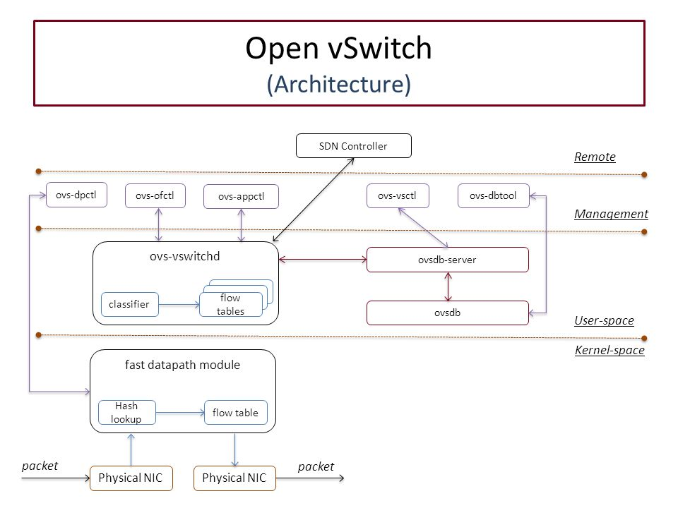

### Openvswitch architecture

+ ovs-vswitchd:
  - daemon chính của Openvswitch
  - chịu trách nhiệm thực hiện chuyển mạch dữ liệu
  - Xử lý các `flow table` và chuyển tiếp gói tin dựa vào rule trong table
+ SDN (Software Defined Networking)
  - tương tác trực tiếp với các tầng chuyển mạch (switch) và định tuyến (router) của mạng
+ ovs-dpctl:
  - công cụ để tạo, sửa và xóa datapath
+ ovs-ofctl
  - công cụ theo dõi và quản trị OpenFlow switch
  - liệt kê các luồng đã triển khai trên OVS kernel
+ ovs-appctl
  - giao tiếp và điều khiển các daemon của OVS
+ ovsdb
  - lưu trữ cấu hình về bridge, port, interface, địa chỉ của OpenFlow controller
  - tổ chức dưới dạng bảng và hàng, tương tự như một cơ sở dữ liệu quan hệ
+ ovsdb-server
  - daemon quản lý cơ sở dữ liệu của OVS
  - cung cấp giao diện RPC(remote procedure call) gọi tới ovsdb
  - có thể chạy như backup server hoặc active server
  - hỗ trợ giao thức OVSDB (Open vSwitch Database Management Protocol) để thực hiện thao tác thêm, sửa, xóa,... trên cơ sở dữ 
+ ovs-vsctl
  - truy vấn và cập nhật cấu hình của ovs-vswitchd (với sự giúp đỡ của ovsdb-server)
+ ovs-dbtool
  - quản lý các cơ sở dữ liệu OVSDB
  - dùng để tạo, kiểm tra, và sửa các file cơ sở dữ liệu
+ Linux kernel module
  - bao gồm openvswitch.ko (chuyển mạch gói tin, xử lý các bảng flow) 
  - datapath (sử dụng các cấu trúc dữ liệu như các bảng hash để quản lý các flow và thực hiện các hành động tương ứng trên các gói tin)

### Flow gói tin 

1. Gói tin đi vào NIC (Network Interface Card) của hệ thống
2. Gói tin chuyển tới openvswitch.ko trong kernel, kiểm tra flow entries trong datapath
3. Nếu không có flow entry phù hợp, gói tin được gửi đến ovs-vswitchd để xử lý, cài đặt thêm flow entry mới nếu cần
4. Gói tin được xử lý theo hành động trong flow entry (Forward, Drop, Modify, Encapsulate)
5. Gói tin được chuyển tới cổng đích và rời khỏi hệ thống qua NIC đích

### Cài đặt openvswitch Ubuntu 16.04

    sudo apt install openvswitch-switch

1. Liệt kê các switch

        ovs-vsctl show
   hoặc

        ovs-vsctl list-br

2. Tạo switch mới

        ovs-vsctl add-br <bridge_name>

3. Xóa switch

        ovs-vsctl del-br <bridge_name>

4. Thêm một port vào switch

        ovs-vsctl add-port <bridge_name> <net interface>

5. Xóa port khỏi switch

        ovs-vsctl del-port <bridge_name> <net interface>

6. Liệt kê thông tin port numbers

        ovs-ofctl dump-ports <bridge_name>

7. Liệt kê thông tin các port trong switch

        ovs-vsctl list-ports <bridge_name>

8. Liệt kê toàn bộ thông tin switch

        ovs-ofctl show <bridge_name>

9. Set kiểu cho port

        ovs-vsctl set interface <net interface> type=<type_name>

10. On/Off giao thức STP

        ovs-vsctl set Bridge <vswitch> stp_enable=<{true|flase}>

11. Kiểm tra trạng thái STP của switch

        ovs-vsctl get bridge <bridge_name> stp_enable

12. Thiết lập bridge priority để chọn root bridge

        ovs-vsctl set bridge <bridge_name> other-config:stp-priority=<priority_value>

13. Thiết lập port priority để chọn root bridge

        ovs-vsctl set port <port_name> other-config:stp-port-priority=<priority_value>
