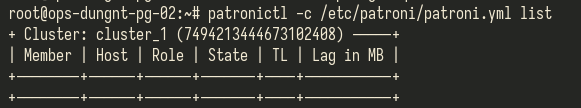

Dữ liệu trước restore


Stop và remove dữ liệu trên các node

```
systemctl stop patroni
rm -rf /var/lib/postgresql/17/main/
```



Restore lại dữ liệu trên 1 node

```
sudo -u postgres pgbackrest  --stanza=cluster_1 --pg1-path=/var/lib/postgresql/17/main/ restore
systemctl start patroni
```


Kiểm tra dữ liệu trên node vừa restore


Start lại patroni trên 2 node còn lại --> tự join cluster và sync dữ liệu.
