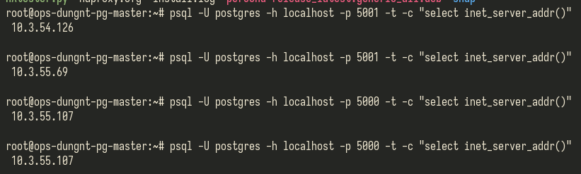
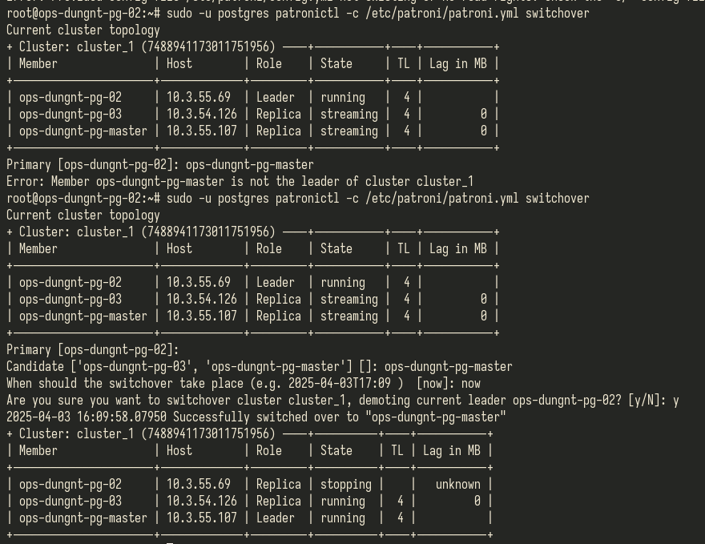
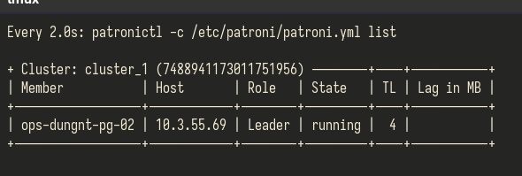

PostgreSQL

Patroni cluster with HAProxy

 `An important concept to understand in a PostgreSQL HA environment like this one is that PostgreSQL should not be started automatically by systemd during the server initialization: we should leave it to Patroni to fully manage it, including the process of starting and stopping the server. Thus, we should disable the service:`

 --> Nên để Patroni quản lý PostgreSQL

Một cách triển khai phổ biến để đảm bảo tính sẵn sàng cao (HA - High Availability) trong môi trường PostgreSQL là sử dụng một proxy: thay vì kết nối trực tiếp đến máy chủ cơ sở dữ liệu, ứng dụng sẽ kết nối đến proxy, proxy này sẽ chuyển tiếp yêu cầu đến PostgreSQL.

Khi sử dụng HAProxy cho mục đích này, cũng có thể định tuyến các yêu cầu đọc đến một hoặc nhiều bản sao (replica) để cân bằng tải. Tuy nhiên, đây không phải là một quá trình minh bạch: ứng dụng cần phải nhận thức được điều này và tự tách biệt lưu lượng đọc (read-only) khỏi lưu lượng ghi (read-write).

Với HAProxy, điều này được thực hiện bằng cách cung cấp hai cổng kết nối riêng biệt cho ứng dụng:

    Ghi (Writes) → Cổng 5000

    Đọc (Reads) → Cổng 5001

  + Primary sẽ dùng port 5000
  + standbys dùng port 5001
  + Để HAProxy biết node nào là primary, node nào là standbys, HAProxy sẽ gửi yêu cầu HTTP đến 8008 của 1 node, Patroni sẽ trả lời.
  + Chỉ có thể ghi vào primary, các table trong standbys sẽ chuyển sang read-only

Backup, Restore

+ Sử dụng pgBackRest cho phép tạo backup, restore từ node standbys
+ Hỗ trợ:
  - full backup - bản sao của toàn bộ data.
  - differential backup - Toàn bộ dữ liệu thay đổi kể từ lần full backup trước.
  - incremental backup - chỉ backup file thay đổi từ lần full backup hoặc differential backup. Cần restore từng incremental backup theo thứ tự backup.

Giả định workload:
+ Chuyển leader sang node khác:

+ Rút 2 node standbys: Mất connection 1 thời gian, hoạt động lại
  - Có lỗi không có thư mục `/var/run/postgresql/` --> không thể chạy patroni, postmaster cũng không chạy --> nguyên nhân đổi mk user postgres, không có quyền tạo pid tại /var/run/
  - Fix lỗi --> dữ liệu sync

