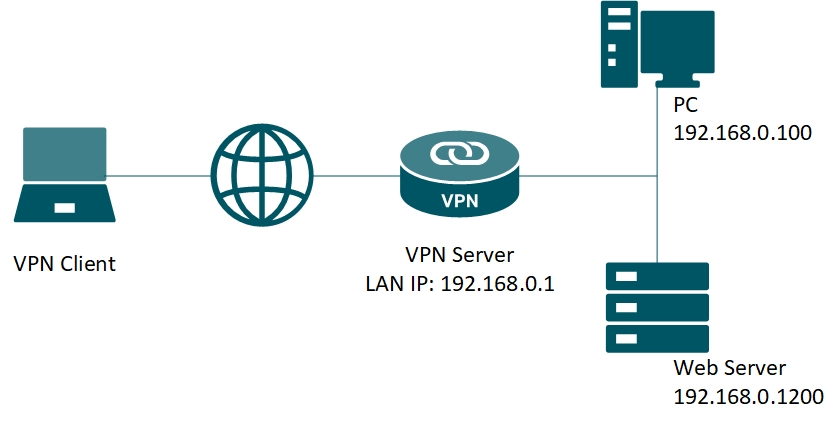

### VPN

1. Khái niệm VPN? Công dụng của VPN

+ VPN (Mạng riêng ảo) tạo ra kết nối mạng riêng tư giữa các thiết bị thông qua Internet.

+ VPN hoạt động bằng cách ẩn địa chỉ IP của người dùng và mã hóa dữ liệu để chỉ người được cấp quyền nhận dữ liệu mới có thể đọc được.

+ Công dụng:

  - Quyền riêng tư: VPN sử dụng mã hóa dữ liệu cá nhân như mật khẩu, thông tin thẻ tín dụng và lịch sử duyệt web,...
  - Tính ẩn danh: VPN che giấu địa chỉ IP thực của người dùng và thay thế bằng địa chỉ IP của máy chủ VPN, giúp người dùng duyệt web ẩn danh và tránh bị theo dõi.
  - Bảo mật: VPN đảm bảo rằng dữ liệu và tài nguyên nội bộ của công ty chỉ có thể truy cập bởi những người dùng được ủy quyền qua kết nối an toàn.

2. Giao thức VPN

+ Point-to-Point Tunneling Protocol (PPTP): Một trong những giao thức VPN lâu đời nhất, được phát triển bởi Microsoft. Nó đơn giản và dễ cài đặt.
  - PPTP đóng gói dữ liệu mạng gốc vào một “IP envelope” (bao IP).
  - Khi PPTP server nhận được các gói dữ liệu đóng gói, nó sẽ loại bỏ lớp bao IP và giải mã dữ liệu mạng gốc bên trong.
  - Dữ liệu sau đó được chuyển tiếp đến đích cuối cùng, chẳng hạn như một trang web hoặc thiết bị đích khác.

  - Bảo mật: Sử dụng các phương pháp mã hóa cơ bản, hiện được coi là không an toàn do nhiều lỗ hổng bảo mật đã được phát hiện. Thiết lập kết nối với IP, username và password.
  

+ Layer 2 Tunneling Protocol (L2TP): Là giao thức kết hợp PPTP và Layer 2 Forwarding (L2F). 

  - Kết nối LAC (L2TP Access Concentrator) và LNS (L2TP Network Server) - hai điểm cuối của giao thức - trên Internet.
  - Một layer liên kết PPP được kích hoạt và đóng gói lại, sau đó, lớp liên kết này được chuyển qua web.
  - Kết nối PPP được khởi tạo bởi người dùng với ISP. Khi LAC chấp nhận kết nối, liên kết PPP được thiết lập.
  - Một vị trí trống trong tunnel mạng được chỉ định và yêu cầu sau đó được chuyển đến LNS. Khi kết nối được xác thực và chấp nhận hoàn toàn, một giao diện PPP ảo sẽ được tạo.

  - Bảo mật: L2TP chỉ tạo đường hầm mà không mã hóa nên thường được sử dụng với Internet Protocol security (IPsec).
+ Secure Socket Tunneling Protocol (SSTP)
+ Internet Key Exchange Version 2 (IKEv2)
+ OpenVPN

3. Cách VPN hoạt động

Hoạt động bằng cách tạo ra một kết nối an toàn và mã hóa giữa thiết bị của người dùng và máy chủ VPN thông qua một đường hầm bảo mật.

+ VPN client-to-site: cho phép người dùng có thể kết nối đến 1 mạng riêng ở xa thông qua 1 VPN server

  - 
+ VPN site-to-site:

