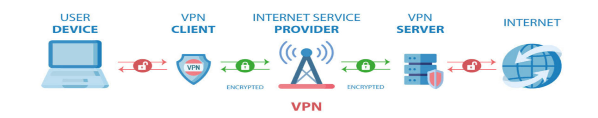

### VPN

1. Khái niệm VPN? Công dụng của VPN

+ VPN (Mạng riêng ảo) tạo ra kết nối mạng riêng tư giữa các thiết bị thông qua Internet.

+ VPN hoạt động bằng cách ẩn địa chỉ IP của người dùng và mã hóa dữ liệu để chỉ người được cấp quyền nhận dữ liệu mới có thể đọc được.

+ Công dụng:

- Quyền riêng tư: VPN sử dụng mã hóa dữ liệu cá nhân như mật khẩu, thông tin thẻ tín dụng và lịch sử duyệt web,...
- Tính ẩn danh: VPN che giấu địa chỉ IP thực của người dùng và thay thế bằng địa chỉ IP của máy chủ VPN, giúp người dùng duyệt web ẩn danh và tránh bị theo dõi.
- Bảo mật: VPN đảm bảo rằng dữ liệu và tài nguyên nội bộ của công ty chỉ có thể truy cập bởi những người dùng được ủy quyền qua kết nối an toàn.

2. Cách VPN hoạt động

Hoạt động bằng cách tạo ra một kết nối an toàn và mã hóa giữa thiết bị của người dùng và máy chủ VPN thông qua một đường hầm bảo mật.

+ VPN client-to-site: cho phép người dùng có thể kết nối đến 1 mạng riêng ở xa thông qua 1 VPN server

- 
+ VPN site-to-site:

