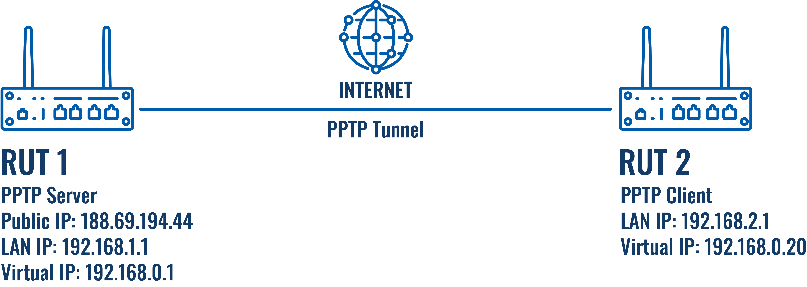
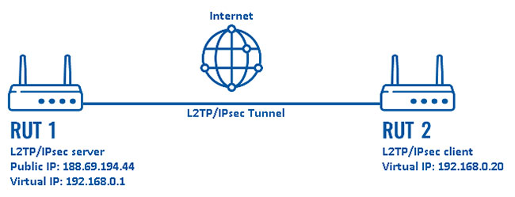
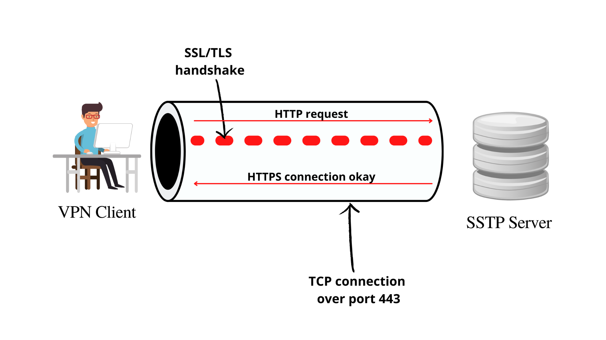
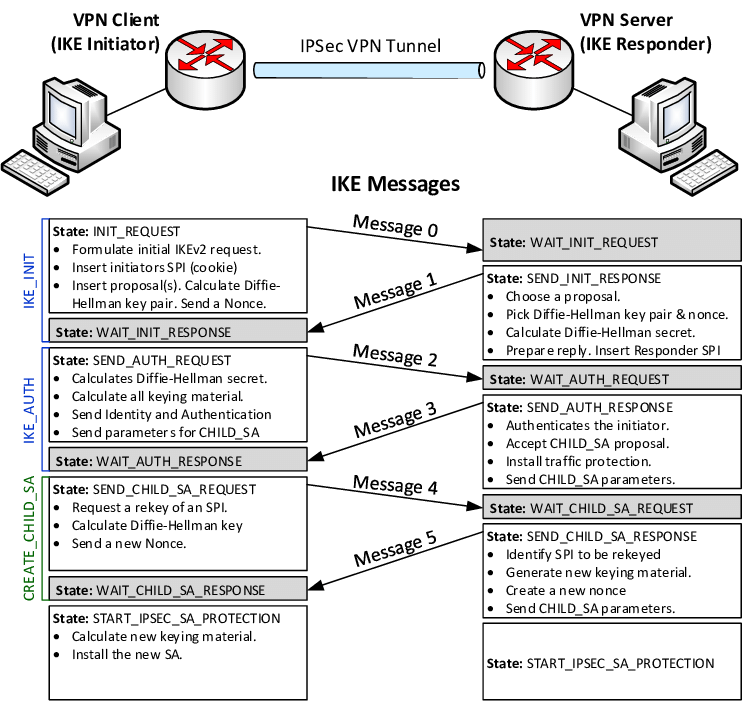
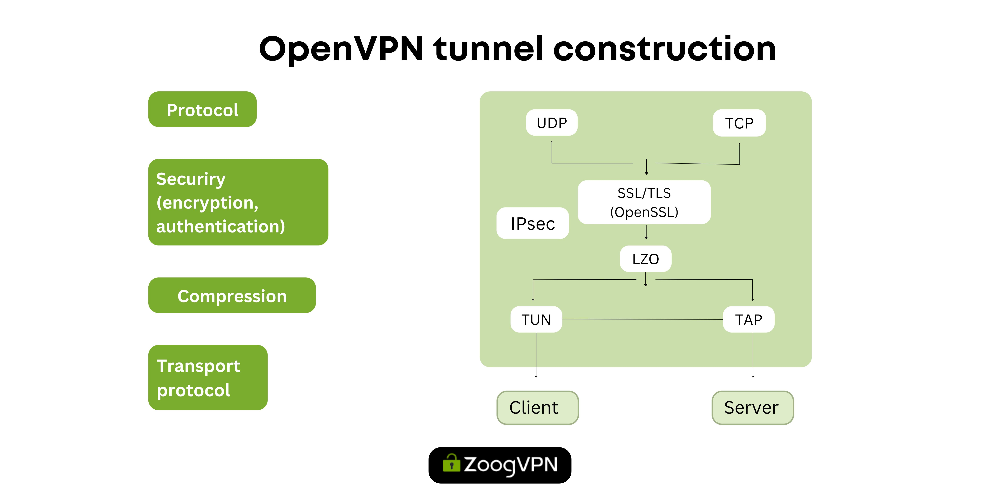
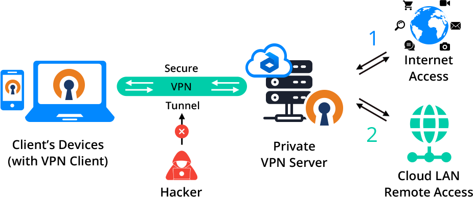
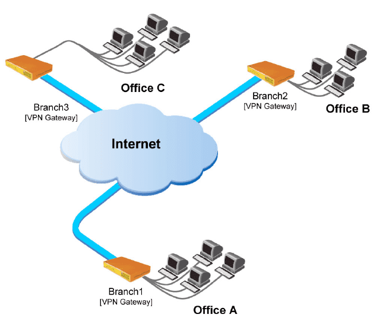
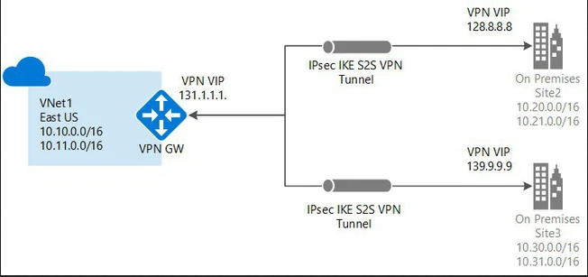

### VPN

1. Khái niệm VPN? Công dụng của VPN

+ VPN (Mạng riêng ảo) tạo ra kết nối mạng riêng tư giữa các thiết bị thông qua Internet.

+ VPN hoạt động bằng cách ẩn địa chỉ IP của người dùng và mã hóa dữ liệu để chỉ người được cấp quyền nhận dữ liệu mới có thể đọc được.

+ Công dụng:

  - Quyền riêng tư: VPN sử dụng mã hóa dữ liệu cá nhân như mật khẩu, thông tin thẻ tín dụng và lịch sử duyệt web,...
  - Tính ẩn danh: VPN che giấu địa chỉ IP thực của người dùng và thay thế bằng địa chỉ IP của máy chủ VPN, giúp người dùng duyệt web ẩn danh và tránh bị theo dõi.
  - Bảo mật: VPN đảm bảo rằng dữ liệu và tài nguyên nội bộ của công ty chỉ có thể truy cập bởi những người dùng được ủy quyền qua kết nối an toàn.

2. Giao thức VPN

+ Point-to-Point Tunneling Protocol (PPTP): Một trong những giao thức VPN lâu đời nhất, được phát triển bởi Microsoft. Nó đơn giản và dễ cài đặt.
  - PPTP đóng gói dữ liệu mạng gốc vào một “IP envelope” (bao IP).
  - Khi PPTP server nhận được các gói dữ liệu đóng gói, nó sẽ loại bỏ lớp bao IP và giải mã dữ liệu mạng gốc bên trong.
  - Dữ liệu sau đó được chuyển tiếp đến đích cuối cùng, chẳng hạn như một trang web hoặc thiết bị đích khác.

  - Bảo mật: Sử dụng các phương pháp mã hóa cơ bản, hiện được coi là không an toàn do nhiều lỗ hổng bảo mật đã được phát hiện. Thiết lập kết nối với IP, username và password.
  



+ Layer 2 Tunneling Protocol (L2TP): Là giao thức kết hợp PPTP và Layer 2 Forwarding (L2F). 

  - Kết nối LAC (L2TP Access Concentrator) và LNS (L2TP Network Server) - hai điểm cuối của giao thức - trên Internet.
  - Một layer liên kết PPP được kích hoạt và đóng gói lại, sau đó, lớp liên kết này được chuyển qua web.
  - Kết nối PPP được khởi tạo bởi người dùng với ISP. Khi LAC chấp nhận kết nối, liên kết PPP được thiết lập.
  - Một vị trí trống trong tunnel mạng được chỉ định và yêu cầu sau đó được chuyển đến LNS. Khi kết nối được xác thực và chấp nhận hoàn toàn, một giao diện PPP ảo sẽ được tạo.

  - Bảo mật: L2TP chỉ tạo đường hầm mà không mã hóa nên thường được sử dụng với Internet Protocol security (IPsec).



+ Secure Socket Tunneling Protocol (SSTP): là một loại VPN tunnel sử dụng kênh SSL 3.0 (cho phép truyền tải và mã hóa dữ liệu, cũng như kiểm tra tính toàn vẹn của lưu lượng) để gửi lưu lượng PPP hoặc L2TP.

SSTP chỉ hoạt động tốt nếu có đủ băng thông trên liên kết mạng không được tạo tunnel. Nếu không có đủ băng thông, TCP timer sẽ hết hạn.

  - SSL sử dụng cổng 443 để kết nối với máy chủ.
  - Để xác nhận kết nối, nó yêu cầu xác thực người dùng và thường được xác thực bởi client.
  - Sử dụng chứng chỉ máy chủ để xác thực.
 
  - Bảo mật: Cung cấp tính bảo mật cao (mã hóa AES 256-bit)




+ Internet Key Exchange Version 2 (IKEv2): là một giao thức tunnelling dựa trên IPSec, cung cấp một kênh giao tiếp VPN bảo mật và xác định các phương tiện kết nối và xác thực tự động cho các liên kết bảo mật IPSec theo cách chúng được bảo vệ.

  - Chịu trách nhiệm thiết lập Security Association (SA) đảm bảo liên kết giữa VPN client và VPN server trong IPSec.
  - Tự động khôi phục kết nối khi có sự cố mạng.

  - Bảo mật: sử dụng xác thực chứng chỉ server (không thực hiện bất kỳ hành động nào cho đến khi xác định được danh tính của người yêu cầu)




+ OpenVPN: là một giải pháp mã nguồn mở và linh hoạt cho mạng riêng ảo (VPN), sử dụng giao thức OpenVPN.

  - Sử dụng SSL (Secure Socket Tunneling protocol)/TLS (Transport Layer Security) để thiết lập kênh bảo mật giữa client và server.
  - Sau khi thiết lập kênh bảo mật, OpenVPN sử dụng giao thức Diffie-Hellman để trao đổi các khóa mã hóa.
  - Khóa mã hóa được sử dụng để tạo một kênh mã hóa bảo mật cho việc truyền dữ liệu. Tất cả dữ liệu truyền qua kênh này đều được mã hóa.



3. Cách VPN hoạt động

+ Kết nối Tunneling: VPN tạo ra một "tunnel" (bọc dữ liệu trong một gói tin khác) giữa thiết bị của người dùng và máy chủ VPN.

+ Mã hóa dữ liệu: Dữ liệu được mã hóa trước khi gửi qua Internet.

+ Thay đổi Địa chỉ IP: Khi kết nối qua VPN, địa chỉ IP của người dùng sẽ được thay đổi thành địa chỉ IP của máy chủ VPN.


4. Phân biệt VPN

+ VPN client-to-site: cho phép người dùng có thể kết nối đến 1 mạng riêng ở xa thông qua 1 VPN server



+ VPN site-to-site:





5. Cấu hình VPN Client-to-Site

+ Tại Site:

  - Cấu hình openvpn config 

```
port 1194
proto udp
dev tun
ca ca.crt
cert issued/server1.crt
key private/server1.key  # This file should be kept secret
dh dh.pem
server 10.8.0.0 255.255.255.0 #subnet cho VPN
ifconfig-pool-persist ipp.txt
push "route 10.20.6.0 255.255.255.0"
keepalive 10 120
tls-auth ta.key 0 # This file is secret
cipher AES-256-CBC
persist-key
persist-tun
status /var/log/openvpn-status.log
log         /var/log/openvpn.log
log-append  /var/log/openvpn.log
verb 3
explicit-exit-notify 1
```

  - Cho phép ip forward: `echo 'net.ipv4.ip_forward=1' >> /etc/sysctl.conf && sysctl -p`
  - Cho phép lưu lượng của client đến LAN: `iptables -t nat -A POSTROUTING -s 10.20.6.0/24 -o eth0 -j MASQUERADE`

  - Route của site khi bật OpenVPN:

```
Destination     Gateway         Genmask         Flags Metric Ref    Use Iface
0.0.0.0         103.107.181.1   0.0.0.0         UG    101    0        0 eth1
10.8.0.0        10.8.0.2        255.255.255.0   UG    0      0        0 tun0
10.8.0.2        0.0.0.0         255.255.255.255 UH    0      0        0 tun0
10.20.6.0       0.0.0.0         255.255.255.0   U     100    0        0 eth0
103.107.181.0   0.0.0.0         255.255.255.0   U     101    0        0 eth1
169.254.169.254 10.20.6.1       255.255.255.255 UGH   100    0        0 eth0
169.254.169.254 103.107.181.120 255.255.255.255 UGH   101    0        0 eth1
```

+ Tại Client:
  - Cấu hình config:

```
client
dev tun
proto udp
remote 103.107.181.141 1194  # Địa chỉ IP của máy chủ OpenVPN và cổng

route 10.20.6.0 255.255.255.0

tls-auth ta.key 1
data-ciphers AES-256-GCM:AES-256-CBC
cipher AES-256-CBC

resolv-retry infinite
remote-cert-tls server
nobind
persist-key
persist-tun
verb 3

<ca>
</ca>
<cert>
</cert>
<key>
</key>
<tls-auth>
</tls-auth>
```
  
  - Kết nối với VPN qua daemon: `openvpn --config client.ovpn --daemon`

  - Route của client khi kết nối thành công:

```
Destination     Gateway         Genmask         Flags Metric Ref    Use Iface
0.0.0.0         45.124.93.1     0.0.0.0         UG    100    0        0 eth0
10.8.0.1        10.8.0.5        255.255.255.255 UGH   0      0        0 tun0
10.8.0.5        0.0.0.0         255.255.255.255 UH    0      0        0 tun0
10.20.6.0       10.8.0.5        255.255.255.0   UG    0      0        0 tun0
45.124.93.0     0.0.0.0         255.255.255.0   U     100    0        0 eth0
169.254.169.254 45.124.93.5     255.255.255.255 UGH   100    0        0 eth0
```
  - Theo dõi client kết nối tại site `/var/log/openvpn.log` hoặc `/var/log/openvpn-status.log`:

```
HEADER,CLIENT_LIST,Common Name,Real Address,Virtual Address,Virtual IPv6 Address,Bytes Received,Bytes Sent,Connected Since,Connected Since (time_t),Username,Client ID,Peer ID,Data Channel Cipher
CLIENT_LIST,client1,45.124.93.154:46893,10.8.0.6,,272040,275076,2024-10-10 16:58:50,1728554330,UNDEF,0,0,AES-256-GCM

hoặc

45.124.93.154:46893 Outgoing Control Channel Authentication: Using 160 bit message hash 'SHA1' for HMAC authentication
45.124.93.154:46893 Incoming Control Channel Authentication: Using 160 bit message hash 'SHA1' for HMAC authentication
45.124.93.154:46893 TLS: Initial packet from [AF_INET]45.124.93.154:46893, sid=7f428ab2 72f19d6d
45.124.93.154:46893 VERIFY OK: depth=1, CN=Server-CA
45.124.93.154:46893 VERIFY OK: depth=0, CN=client1
45.124.93.154:46893 peer info: IV_VER=2.5.11
45.124.93.154:46893 peer info: IV_PLAT=linux
45.124.93.154:46893 peer info: IV_PROTO=6
45.124.93.154:46893 peer info: IV_CIPHERS=AES-256-GCM:AES-256-CBC
45.124.93.154:46893 peer info: IV_LZ4=1
45.124.93.154:46893 peer info: IV_LZ4v2=1
45.124.93.154:46893 peer info: IV_LZO=1
45.124.93.154:46893 peer info: IV_COMP_STUB=1
45.124.93.154:46893 peer info: IV_COMP_STUBv2=1
45.124.93.154:46893 peer info: IV_TCPNL=1
45.124.93.154:46893 Control Channel: TLSv1.3, cipher TLSv1.3 TLS_AES_256_GCM_SHA384, peer certificate: 2048 bit RSA, signature: RSA-SHA256
45.124.93.154:46893 [client1] Peer Connection Initiated with [AF_INET]45.124.93.154:46893
client1/45.124.93.154:46893 MULTI_sva: pool returned IPv4=10.8.0.6, IPv6=(Not enabled)
client1/45.124.93.154:46893 MULTI: Learn: 10.8.0.6 -> client1/45.124.93.154:46893
client1/45.124.93.154:46893 MULTI: primary virtual IP for client1/45.124.93.154:46893: 10.8.0.6
client1/45.124.93.154:46893 Data Channel: using negotiated cipher 'AES-256-GCM'
client1/45.124.93.154:46893 Outgoing Data Channel: Cipher 'AES-256-GCM' initialized with 256 bit key
client1/45.124.93.154:46893 Incoming Data Channel: Cipher 'AES-256-GCM' initialized with 256 bit key
client1/45.124.93.154:46893 SENT CONTROL [client1]: 'PUSH_REPLY,route 10.20.6.0 255.255.255.0,route 10.8.0.1,topology net30,ping 10,ping-restart 120,ifconfig 10.8.0.6 10.8.0.5,peer-id 0,cipher AES-256-GCM' (status=1)
```

  - Để log file có timestamp, cấu hình unit file tại `/etc/systemd/system/multi-user.target.wants/openvpn-server@server.service` loại bỏ `--suppress-timestamps`.
    + `systemctl daemon-reload`

6. Theo dõi kết nối client

- Thêm `management localhost 6666` vào `/etc/openvpn/server/server.conf`.

- Telnet vào `telnet localhost 6666` và kiểm tra `status`.

7. Cơ chế xác thực:

- PAM (Pluggable Authentication Modules): cấu hình sử dụng `/etc/passwd` và `/etc/shadow` để xác thực người dùng:
  + Cấu hình pam tại `/etc/pam.d/openvpn`:

```
auth required pam_unix.so
account required pam_unix.so
```

  + Cấu hình tại site:

```
plugin /usr/lib64/openvpn/plugins/openvpn-plugin-auth-pam.so login
username-as-common-name
```

  + Cấu hình tại client:

```
auth-user-pass <file> #có thể thêm file lưu tài khoản hoặc nhập lúc kết nối
```

- auth-user-pass-verify: sử dụng script tùy ý để xác thực user:
  + Cấu hình tại site:

```
auth-user-pass-verify /etc/openvpn/server/auth-script.sh <via-file | via-env>
username-as-common-name
```

  + Cấu hình `auth-script.sh` do mình xác định, ví dụ:

```
#!/bin/bash
USERNAME=$1
PASSWORD=$2
PASS_FILE="/etc/openvpn/server/user_pass.txt"

# Kiểm tra username và password có trong file không
if grep -q "^$USERNAME:$PASSWORD$" $PASS_FILE; then
  exit 0  # Thành công
else
  exit 1  # Thất bại
fi
```

  + Cấu hình tại client:

```
auth-user-pass <file> #có thể thêm file lưu tài khoản hoặc nhập lúc kết nối
```

    
